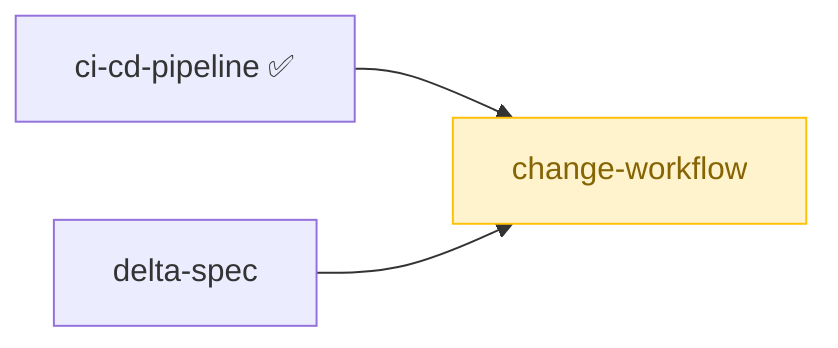
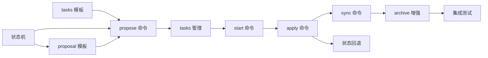

# Change Workflow 实现计划

## 优先级
**P1** — Change Workflow 是 spec 变更生命周期管理的核心功能，让每次变更可追溯、可审计、可回滚。依赖 Delta Spec 的合并能力，应在 Delta Spec 之后实现。

## 依赖关系

> change-workflow 依赖 delta-spec 的合并能力和 ci-cd-pipeline。

## 任务依赖图

## 任务分解

| 序号 | 任务名 | 涉及文件 | 预估工作量 | 前置依赖 |
|------|--------|----------|------------|----------|
| 1 | 定义变更状态枚举和状态机模型 | `src/workflow/types.ts`, `src/workflow/state-machine.ts` | 2h | 无 |
| 2 | 实现 propose 命令（创建 proposal.md 和 tasks.md） | `src/commands/propose.ts` | 3h | 任务 1 |
| 3 | 实现 tasks.md 解析器（任务项识别、状态解析） | `src/workflow/tasks-parser.ts` | 3h | 无 |
| 4 | 实现 start 命令（draft -> in-progress，校验任务列表） | `src/commands/start.ts` | 2h | 任务 1, 3 |
| 5 | 实现 apply 命令（逐项实施、进度更新、冲突检测） | `src/commands/apply.ts` | 4h | 任务 1, 3 |
| 6 | 实现 sync 命令（合并到主 spec、冲突检测） | `src/commands/sync.ts` | 5h | 任务 1, Delta Spec 合并算法 |
| 7 | 实现 archive 命令（归档到 archive 目录、生成摘要） | `src/commands/archive.ts` | 3h | 任务 1 |
| 8 | 实现状态流转校验（拒绝非法跳转、支持回退） | `src/workflow/state-machine.ts` | 2h | 任务 1 |
| 9 | 实现特殊字符标题规范化 | `src/workflow/slugify.ts` | 1h | 无 |
| 10 | 实现变更查询命令（列出归档变更） | `src/commands/list-changes.ts` | 2h | 任务 7 |
| 11 | 编写单元测试 | `tests/workflow/*.test.ts` | 4h | 全部任务 |
| 12 | 编写集成测试（propose -> start -> apply -> sync -> archive 端到端） | `tests/integration/workflow.test.ts` | 3h | 全部任务 |

## 验收标准

1. **创建变更提案**：执行 propose 命令后在 `.superspec/changes/` 下创建子目录，包含 proposal.md 和 tasks.md，状态为 draft。
2. **项目未初始化时拒绝**：未执行 init 的目录中执行 propose 返回错误提示。
3. **特殊字符标题**：斜杠、空格、中文标题被规范化为合法目录名，proposal.md 保留原始标题。
4. **任务管理**：tasks.md 中的任务项可识别完成状态，全部完成后提示可进入下一阶段；格式错误时报告行号；空任务列表拒绝推进到 in-progress。
5. **实施变更**：逐项标记 done 后更新进度；未完成任务时拒绝 apply 到 review；并发修改时检测冲突。
6. **同步变更**：review 状态的变更可 sync 到主 spec，状态更新为 done；检测合并冲突；拒绝未审核的变更。
7. **归档变更**：done 状态的变更移至 `.superspec/archive/`，状态更新为 archived；拒绝归档未完成变更；支持查询归档变更。
8. **状态流转**：严格按 draft -> in-progress -> review -> done -> archived 流转；拒绝非法跳转；支持回退并记录原因。

## 风险点

1. **与 Delta Spec 的依赖**：sync 命令依赖 Delta Spec 的合并算法，如果 Delta Spec 未完成，sync 功能无法实现。需要考虑降级方案（如简单的文本替换合并）。
2. **并发修改冲突**：多人同时修改同一变更的不同任务时，文件级别的冲突检测较难实现，可能需要依赖 git 的冲突检测机制。
3. **tasks.md 格式灵活性**：Markdown 格式的任务列表解析需要处理多种变体（不同的 checkbox 语法、缩进方式等），过于严格会影响用户体验。
4. **状态持久化**：变更状态需要持久化存储，是放在 proposal.md 中还是独立的状态文件需要权衡。
5. **归档后查询性能**：大量归档变更的查询可能较慢，需要考虑索引机制。
