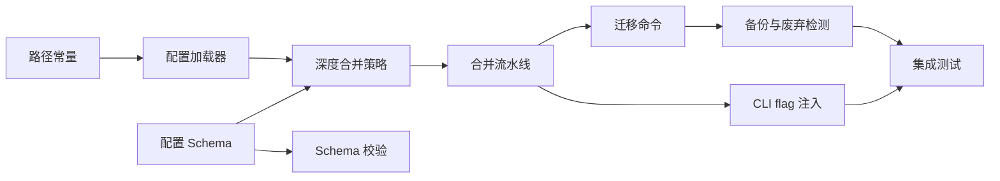

# 配置分层系统实现计划

## 优先级
**P1** — 配置分层系统为多环境、多用户、多变更并行场景提供灵活的配置覆盖能力。对团队协作和 CI/CD 流水线至关重要，但不影响单用户基本使用。

## 依赖关系

> config-layers 是独立模块，仅依赖 ci-cd-pipeline。

## 任务依赖图

## 任务分解

| 序号 | 任务名 | 涉及文件 | 预估工作量 | 前置依赖 |
|------|--------|----------|------------|----------|
| 1 | 定义配置 Schema（Zod）：全局、项目、变更三层的所有配置项 | `src/config/schema.ts` | 3h | 无 |
| 2 | 实现全局配置加载器（`~/.config/superspec/config.json`） | `src/config/loaders/global.ts` | 2h | 任务 1 |
| 3 | 实现项目配置加载器（`.superspec/config.yaml`） | `src/config/loaders/project.ts` | 2h | 任务 1 |
| 4 | 实现变更配置加载器（`.superspec/changes/<name>/.superspec.yaml`） | `src/config/loaders/change.ts` | 2h | 任务 1 |
| 5 | 实现配置合并引擎（深度合并对象、覆盖数组和基础类型） | `src/config/merger.ts` | 4h | 任务 2, 3, 4 |
| 6 | 实现优先级解析（CLI flag > 变更 > 项目 > 全局 > 默认值） | `src/config/resolver.ts` | 3h | 任务 5 |
| 7 | 实现 CLI flag 解析与注入 | `src/config/cli-flags.ts` | 2h | 任务 6 |
| 8 | 实现配置 Schema 校验器（Zod 校验、错误诊断、行号定位） | `src/config/validator.ts` | 3h | 任务 1 |
| 9 | 实现未知字段检测（WARNING）和类型错误检测（ERROR） | `src/config/validator.ts` | 2h | 任务 8 |
| 10 | 实现旧版 config.yaml 迁移命令（智能拆分、备份、废弃字段处理） | `src/commands/config-migrate.ts` | 4h | 任务 5 |
| 11 | 实现配置初始化（所有配置文件缺失时的默认值和文件创建） | `src/commands/init.ts` | 2h | 任务 1 |
| 12 | 编写单元测试 | `tests/config/*.test.ts` | 4h | 全部任务 |
| 13 | 编写集成测试（三层配置合并、CLI flag 覆盖、迁移命令） | `tests/integration/config.test.ts` | 3h | 全部任务 |

## 验收标准

1. **三层配置加载**：全局、项目、变更三层配置文件均存在时正确加载，最终配置合并三层的值。
2. **只有全局配置**：仅全局配置存在时使用其值，缺失项使用内置默认值。
3. **所有配置缺失**：使用内置默认值完成初始化，创建项目配置文件。
4. **CLI flag 覆盖**：`superspec validate --strict` 中的 flag 覆盖项目和全局配置。
5. **变更配置覆盖项目**：变更目录下的配置覆盖项目配置的同名项。
6. **全局兜底**：项目和变更配置未设置的项使用全局配置值。
7. **对象深度合并**：`validation.rules` 中项目配置覆盖 `max-line-length`，保留全局的 `no-trailing-spaces`。
8. **数组直接覆盖**：项目配置的 `hooks.pre-validate` 完全替换全局配置的数组。
9. **嵌套三层合并**：三层对象的嵌套属性按优先级正确合并。
10. **Schema 校验通过**：合法配置文件正常完成校验。
11. **未知字段检测**：包含未定义字段时输出警告。
12. **类型错误检测**：字段类型不匹配时输出错误信息并以非零退出码终止。
13. **迁移成功**：旧配置迁移到新版，原文件备份为 `.bak`。
14. **迁移时旧文件不存在**：输出提示信息，零退出码结束。
15. **迁移废弃字段**：废弃字段记录到迁移报告，从新配置中排除。

## 风险点

1. **配置项命名冲突**：三层配置的同名配置项需要严格的优先级规则，模糊的优先级会导致行为不可预测。
2. **深度合并的边界情况**：多层嵌套对象的深度合并可能产生意外结果，特别是当某层将对象类型改为数组类型时。
3. **YAML/JSON 混合使用**：全局配置用 JSON，项目配置用 YAML，需要确保两种格式的解析行为一致。
4. **迁移命令的向后兼容**：旧版配置文件的格式可能有多种变体，迁移命令需要处理所有已知格式。
5. **配置热更新**：变更配置在变更目录切换时是否需要重新加载，需要明确生命周期管理策略。
6. **安全敏感配置**：某些配置可能包含敏感信息（如 API token），需要考虑配置文件的权限管理。
