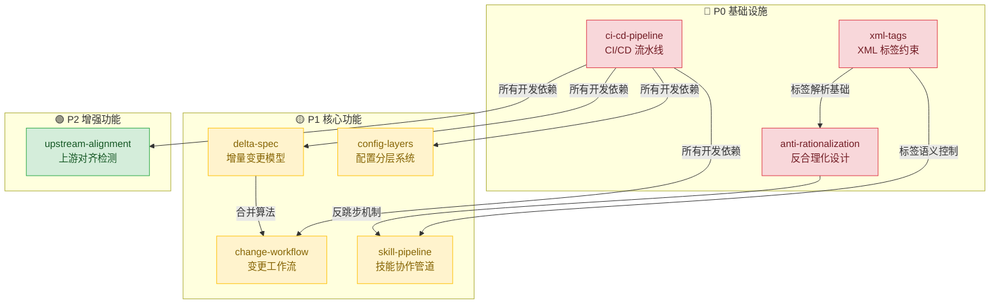
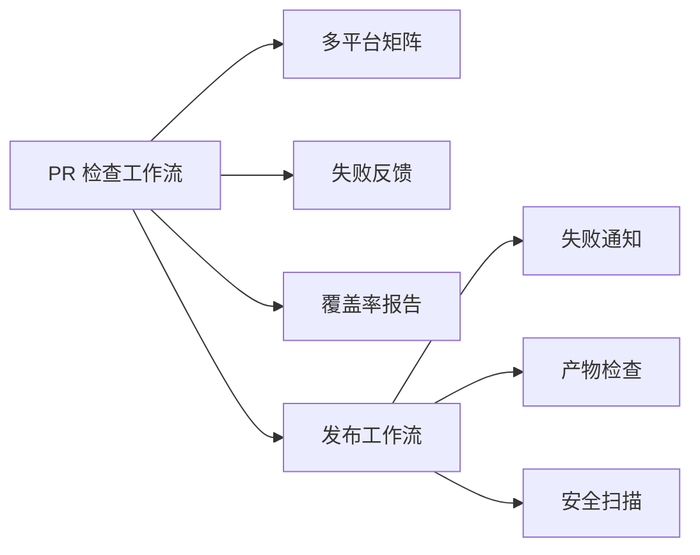
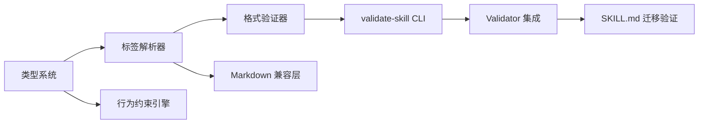
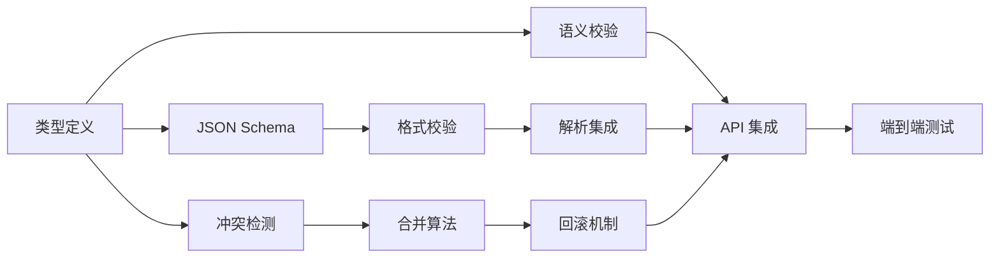
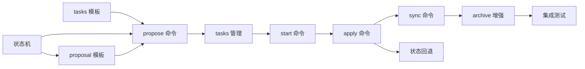
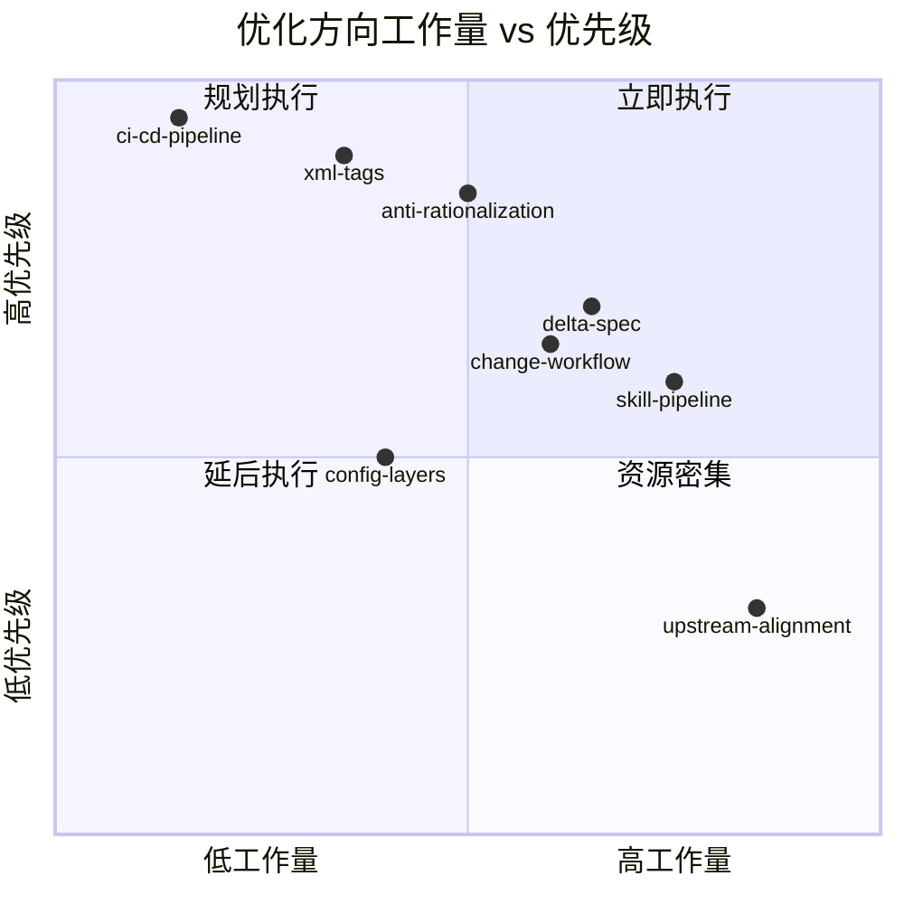

# superSpec v5 优化方向依赖关系图

## 全局依赖图

```mermaid
flowchart TB
  subgraph P0["🔴 P0 基础设施"]
    cicd["ci-cd-pipeline<br/>CI/CD 流水线"]
    xml["xml-tags<br/>XML 标签约束"]
    anti["anti-rationalization<br/>反合理化设计"]
  end

  subgraph P1["🟡 P1 核心功能"]
    delta["delta-spec<br/>增量变更模型"]
    change["change-workflow<br/>变更工作流"]
    skill["skill-pipeline<br/>技能协作管道"]
    config["config-layers<br/>配置分层系统"]
  end

  subgraph P2["🟢 P2 增强功能"]
    upstream["upstream-alignment<br/>上游对齐检测"]
  end

  cicd -->|"所有开发依赖"| delta
  cicd -->|"所有开发依赖"| change
  cicd -->|"所有开发依赖"| config
  cicd -->|"所有开发依赖"| upstream

  xml -->|"标签解析基础"| anti
  xml -->|"标签语义控制"| skill
  anti -->|"反跳步机制"| skill

  delta -->|"合并算法"| change

  classDef p0 fill:#f8d7da,stroke:#dc3545,color:#721c24
  classDef p1 fill:#fff3cd,stroke:#ffc107,color:#856404
  classDef p2 fill:#d4edda,stroke:#28a745,color:#155724

  class cicd,xml,anti p0
  class delta,change,skill,config p1
  class upstream p2
```

## 实施顺序（拓扑排序）

```mermaid
flowchart LR
  subgraph Wave1["Wave 1"]
    cicd["ci-cd-pipeline"]
    config["config-layers"]
  end

  subgraph Wave2["Wave 2"]
    xml["xml-tags"]
    delta["delta-spec"]
  end

  subgraph Wave3["Wave 3"]
    anti["anti-rationalization"]
    change["change-workflow"]
  end

  subgraph Wave4["Wave 4"]
    skill["skill-pipeline"]
  end

  subgraph Wave5["Wave 5"]
    upstream["upstream-alignment"]
  end

  Wave1 --> Wave2 --> Wave3 --> Wave4 --> Wave5

  classDef wave1 fill:#f8d7da,stroke:#dc3545,color:#721c24
  classDef wave2 fill:#fff3cd,stroke:#ffc107,color:#856404
  classDef wave3 fill:#cce5ff,stroke:#007bff,color:#004085
  classDef wave4 fill:#d4edda,stroke:#28a745,color:#155724
  classDef wave5 fill:#e2e3e5,stroke:#6c757d,color:#383d41

  class cicd,config wave1
  class xml,delta wave2
  class anti,change wave3
  class skill wave4
  class upstream wave5
```

## 每个方向的内部任务依赖

### ci-cd-pipeline（已完成 ✅）

```mermaid
flowchart LR
  T1["PR 检查工作流"] --> T2["多平台矩阵"]
  T1 --> T3["失败反馈"]
  T1 --> T4["覆盖率报告"]
  T1 --> T5["发布工作流"]
  T5 --> T6["失败通知"]
  T5 --> T7["产物检查"]
  T5 --> T8["安全扫描"]
```

### xml-tags

```mermaid
flowchart LR
  T1["类型系统"] --> T2["标签解析器"]
  T1 --> T4["行为约束引擎"]
  T2 --> T3["格式验证器"]
  T2 --> T5["Markdown 兼容层"]
  T3 --> T6["validate-skill CLI"]
  T6 --> T7["Validator 集成"]
  T7 --> T8["SKILL.md 迁移验证"]
```

### delta-spec

```mermaid
flowchart LR
  T1["类型定义"] --> T2["JSON Schema"]
  T1 --> T4["语义校验"]
  T1 --> T5["冲突检测"]
  T2 --> T3["格式校验"]
  T3 --> T8["解析集成"]
  T4 --> T9["API 集成"]
  T5 --> T6["合并算法"]
  T6 --> T7["回滚机制"]
  T8 --> T9
  T7 --> T9
  T9 --> T10["端到端测试"]
```

### change-workflow

```mermaid
flowchart LR
  T1["状态机"] --> T2["proposal 模板"]
  T3["tasks 模板"] --> T4["propose 命令"]
  T1 --> T4
  T2 --> T4
  T4 --> T5["tasks 管理"]
  T5 --> T6["start 命令"]
  T6 --> T7["apply 命令"]
  T7 --> T8["sync 命令"]
  T8 --> T9["archive 增强"]
  T7 --> T10["状态回退"]
  T9 --> T11["集成测试"]
```

## 工作量分布

```mermaid
quadrantChart
  title 优化方向工作量 vs 优先级
  x-axis 低工作量 --> 高工作量
  y-axis 低优先级 --> 高优先级
  quadrant-1 立即执行
  quadrant-2 规划执行
  quadrant-3 延后执行
  quadrant-4 资源密集
  "ci-cd-pipeline": [0.15, 0.95]
  "xml-tags": [0.35, 0.90]
  "anti-rationalization": [0.50, 0.85]
  "delta-spec": [0.65, 0.70]
  "change-workflow": [0.60, 0.65]
  "skill-pipeline": [0.75, 0.60]
  "config-layers": [0.40, 0.50]
  "upstream-alignment": [0.85, 0.30]
```
