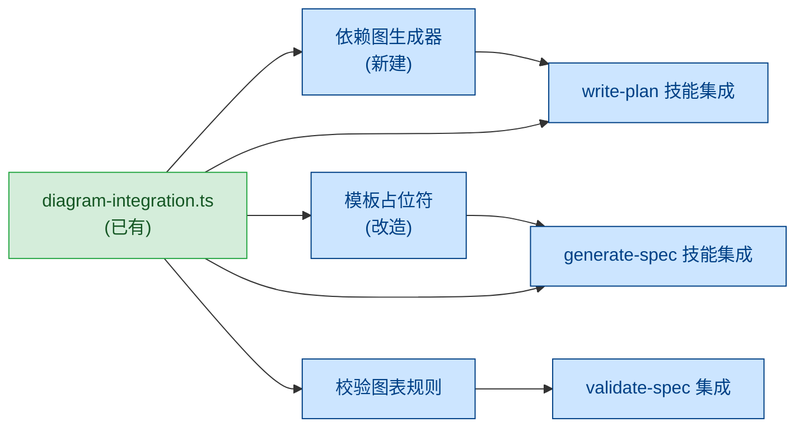
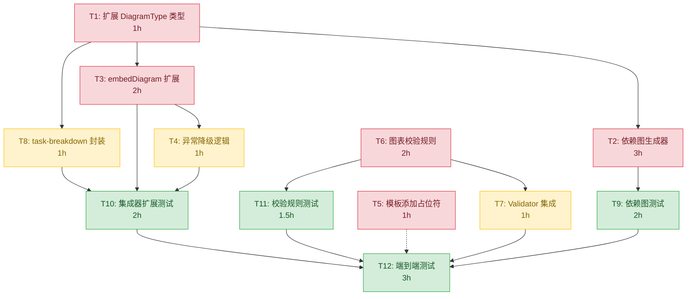

# 图表嵌入规范 实现计划

## 优先级

**P0** — 图表系统已建好（diagram-integration.ts + flowchart/state/decision 生成器）但全链路未打通，模板无占位符、技能无自动调用、校验无检测。这是阻塞图表实际使用的最后一个环节，直接影响所有产出物的可视化质量。

## 依赖关系图

> 已有基础设施（diagram-integration.ts、flowchart.ts 等）用绿色标注，需新建或改造的模块用蓝色标注。

## 任务分解

| 序号 | 任务名 | 涉及文件 | 预估工作量 | 前置依赖 |
|------|--------|----------|------------|----------|
| 1 | 扩展 DiagramType 类型，新增 `task-breakdown` 和 `dependency-graph` 类型标识，更新 DIAGRAM_TITLES 映射 | `src/core/diagrams/diagram-integration.ts` | 1h | 无 |
| 2 | 新建依赖关系图生成器 `generateDependencyGraph()`，从 Plan 任务列表生成 Mermaid flowchart，支持箭头方向表示依赖、循环依赖红色标记、单节点降级 | `src/core/diagrams/dependency-graph.ts`, `src/core/diagrams/index.ts` | 3h | 任务 1 |
| 3 | 扩展 `embedDiagram()` 支持缺失占位符时追加到末尾并输出 WARNING（当前逻辑追加到开头，需改为追加到末尾的 Diagram 章节），增加占位符类型不匹配时的 WARNING 逻辑 | `src/core/diagrams/diagram-integration.ts` | 2h | 任务 1 |
| 4 | 在 `embedDiagram()` 中增加 try-catch 降级逻辑：图表生成器异常时输出占位符注释 + ERROR 日志，不中断流程 | `src/core/diagrams/diagram-integration.ts` | 1h | 任务 3 |
| 5 | 在模板文件和 template-generator.ts 中添加 `<!-- DIAGRAM:task-breakdown -->` 占位符 | `templates/spec-template.md`, `src/core/template-generator.ts` | 1h | 无 |
| 6 | 新建图表存在性校验规则 `diagramPresenceRule`：检测 spec 中是否包含 `<!-- DIAGRAM:xxx -->` 或 mermaid 代码块，缺失时 WARNING；检测 mermaid 语法基本合法性 | `src/core/rules/builtin/diagram-presence.ts`, `src/core/rules/index.ts` | 2h | 无 |
| 7 | 将图表校验结果集成到 ValidationReport 结构中，新增 `diagram` 字段（present/type/valid） | `src/core/validator.ts` | 1h | 任务 6 |
| 8 | 新建 `generateTaskBreakdownDiagram()` 封装函数，接受 Spec 结构化数据，调用现有 `generateFlowchart()` 并处理零 Requirement 边界（仅输出根节点） | `src/core/diagrams/task-breakdown.ts`, `src/core/diagrams/index.ts` | 1h | 任务 1 |
| 9 | 编写依赖关系图生成器单元测试：正常多任务依赖、循环依赖检测、单节点降级 | `test/core/diagrams/dependency-graph.test.ts` | 2h | 任务 2 |
| 10 | 编写图表集成器扩展测试：占位符替换、缺失占位符追加到末尾、类型不匹配 WARNING、异常降级、零 Requirement 边界 | `test/core/diagrams/diagram-integration.test.ts` | 2h | 任务 3, 4, 8 |
| 11 | 编写图表校验规则单元测试：有图表通过、无图表 WARNING、mermaid 语法错误 WARNING | `test/core/rules/diagram-presence.test.ts` | 1.5h | 任务 6 |
| 12 | 编写端到端集成测试：从模板生成 spec（含图表）-> 校验通过 -> 生成计划（含依赖图）完整链路 | `test/e2e/diagram-embedding.test.ts` | 3h | 全部任务 |

## 内部任务依赖图

## 验收标准

### 模板图表占位符
1. 模板文件包含 `<!-- DIAGRAM:task-breakdown -->` 占位符，generate-spec 使用模板生成 spec 时占位符被替换为实际 Mermaid 图表
2. 旧版模板无占位符时，技能在 spec 末尾追加 `## Diagram` 章节 + Mermaid 图表，并输出 WARNING
3. 占位符类型不匹配时，替换为正确的图表类型并输出 WARNING

### generate-spec 技能图表输出
4. generate-spec 自动调用 `generateTaskBreakdownDiagram(specData)` 生成任务分解图，图表节点与 Requirement 一一对应
5. 图表生成器不可用时，Diagram 章节放置 `<!-- DIAGRAM:task-breakdown - 生成失败：图表模块不可用 -->`，输出 ERROR 但不中断
6. spec 零个 Requirement 时，输出仅含根节点的空 Mermaid 图 + WARNING

### write-plan 技能图表输出
7. write-plan 自动调用依赖图生成器，箭头方向表示任务依赖方向
8. 循环依赖节点标记为红色样式，输出 ERROR 指出循环路径
9. 单任务计划输出单节点 Mermaid 图 + WARNING

### validate-spec 图表校验
10. spec 包含有效图表时，校验结果包含 `diagram: {present: true, type: "task-breakdown", valid: true}`
11. spec 缺少图表时，输出 WARNING 级别提示，整体校验仍可为 valid
12. 图表存在但 mermaid 语法错误时，WARNING 指出具体位置，`diagram.valid = false`

### 图表生成器自动调用
13. generate-spec 进入图表嵌入阶段时自动导入 diagram-integration 模块并调用
14. 图表生成器抛出异常时捕获、输出 ERROR、放置降级占位符、不中断流程
15. 自定义技能未配置图表步骤时不强制调用，但 validate-spec 仍输出 WARNING

## 风险点

1. **DiagramType 类型扩展的向后兼容**：现有代码使用 `flowchart | state | decision`，新增 `task-breakdown` 和 `dependency-graph` 需确保不影响已有图表生成逻辑。建议通过类型别名或映射层过渡。
2. **依赖图生成器的循环依赖检测算法**：Tarjan 或 DFS 回边检测，需处理自循环和间接循环，复杂度需控制在 O(V+E)。
3. **Mermaid 语法校验的完备性**：完整解析 Mermaid 语法代价过高，建议只做基础检查（`graph`/`flowchart` 声明行存在、代码块非空），不追求完整语法验证。
4. **模板改造对已有产物的影响**：修改 spec-template.md 后，已生成的 spec 文件不会自动获得占位符，依赖 fallback 逻辑（追加到末尾）保证兼容。
5. **技能文件不存在的风险**：`.superspec/skills/` 目录当前不存在，generate-spec 和 write-plan 作为 AI 技能而非代码模块存在。图表自动调用需要在技能指令（SKILL.md 或 prompt）中嵌入调用说明，而非代码层面的 import。
