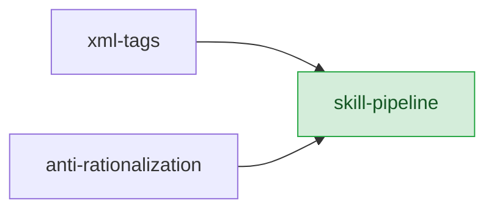
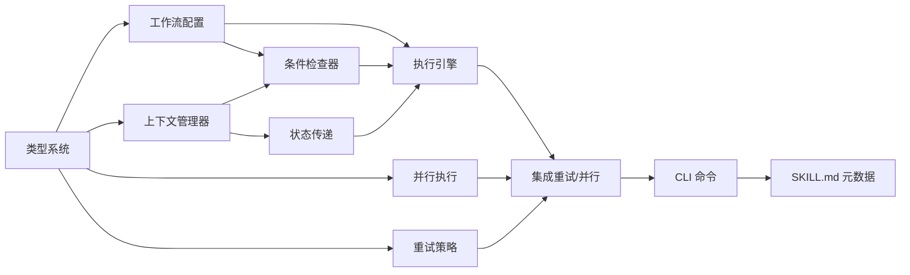

# 技能间协作管道实现计划

## 优先级
**P1** — 技能管道将松散的技能集合进化为结构化工作流引擎，提升用户体验和自动化程度。依赖 XML 标签系统和 Anti-Rationalization 机制，应在两者完成后再实现。

## 依赖关系

> skill-pipeline 依赖 xml-tags 和 anti-rationalization，是最复杂的集成点。

## 任务依赖图

## 任务分解

| 序号 | 任务名 | 涉及文件 | 预估工作量 | 前置依赖 |
|------|--------|----------|------------|----------|
| 1 | 定义核心工作流链模型（七阶段：brainstorm -> generate-spec -> validate-spec -> write-plan -> 实现 -> verify -> archive） | `src/pipeline/workflow-chain.ts` | 3h | 无 |
| 2 | 定义上下文对象数据结构（specPath、validationResult、planPath、verifyReport 等） | `src/pipeline/context.ts` | 2h | 无 |
| 3 | 实现上下文读写 API | `src/pipeline/context.ts` | 2h | 任务 2 |
| 4 | 实现工作流链执行引擎（顺序执行、阶段切换） | `src/pipeline/executor.ts` | 5h | 任务 1, 3 |
| 5 | 实现中间阶段入口支持（从指定阶段开始执行） | `src/pipeline/executor.ts` | 2h | 任务 4 |
| 6 | 实现可选阶段跳过逻辑 | `src/pipeline/executor.ts` | 1h | 任务 4 |
| 7 | 实现前置条件检查框架（输入文件存在、上游完成） | `src/pipeline/preconditions.ts` | 3h | 任务 3 |
| 8 | 实现后置条件验证框架（输出文件生成、校验通过） | `src/pipeline/postconditions.ts` | 3h | 任务 3 |
| 9 | 实现并行执行调度器（依赖关系分析、并发控制） | `src/pipeline/parallel-scheduler.ts` | 5h | 任务 4 |
| 10 | 实现失败回退策略（数据格式错误回退生成、逻辑错误回退需求、临时错误重试） | `src/pipeline/rollback.ts` | 4h | 任务 4 |
| 11 | 实现重试机制（最大重试次数、重试日志、等待间隔） | `src/pipeline/retry.ts` | 3h | 任务 10 |
| 12 | 实现资源限制配置（最大并行数） | `src/pipeline/config.ts` | 1h | 任务 9 |
| 13 | 为每个现有技能添加前置/后置条件声明 | `.superspec/skills/*/SKILL.md` | 4h | 任务 7, 8 |
| 14 | 编写单元测试 | `tests/pipeline/*.test.ts` | 4h | 全部任务 |
| 15 | 编写集成测试（完整工作流链端到端、并行校验、失败回退） | `tests/integration/pipeline.test.ts` | 4h | 全部任务 |

## 验收标准

1. **完整工作流执行**：从 brainstorm 到 archive 七阶段按顺序执行，每阶段完成后自动进入下一阶段。
2. **中间阶段入口**：已有校验通过的 spec 时可从 write-plan 开始，spec 作为输入传递。
3. **可选阶段跳过**：标记为可选的 debug 阶段在无调试需求时跳过，日志记录跳过原因。
4. **状态传递**：brainstorm 输出传递给 generate-spec；validate-spec 校验失败时阻断传递并回退。
5. **缺少必要字段**：上下文中缺少 specPath 时报告明确错误，提示从更早阶段开始或手动指定。
6. **并行校验**：3 个 spec 文件并行启动 3 个 validate-spec 实例，最终汇总结果。
7. **并行失败处理**：1 个实例失败时等待所有实例完成，汇总报告通过/失败数。
8. **资源限制**：最大并行数为 2 时，5 个任务最多同时运行 2 个，完成后立即启动下一个。
9. **前置条件通过**：spec 存在且已校验时 write-plan 正常执行。
10. **前置条件失败**：spec 不存在时拒绝执行并报告原因。
11. **后置条件失败**：verify 有失败测试时阻止进入 archive，提示修复。
12. **校验失败回退**：validate-spec 未通过时自动回退到 generate-spec，附带诊断信息。
13. **临时错误重试**：测试超时时重试一次（等待 5 秒），仍失败则停止。
14. **最大重试次数**：连续 3 次未通过后停止重试，写入完整重试日志。

## 风险点

1. **技能间的耦合度**：过度标准化的管道可能降低灵活性，某些场景需要自定义工作流。需要支持用户自定义管道配置。
2. **上下文对象膨胀**：随着技能增多，上下文对象可能变得过大，需要考虑分层和懒加载。
3. **并行执行的资源竞争**：多个技能实例并行运行时可能竞争文件系统资源，需要实现文件锁机制。
4. **回退策略的复杂性**：不同类型错误的回退策略可能产生冲突，需要明确优先级规则。
5. **与 Anti-Rationalization 的交互**：管道的自动回退可能与反合理化的强制检查清单产生冲突，需要协调两者的行为。
