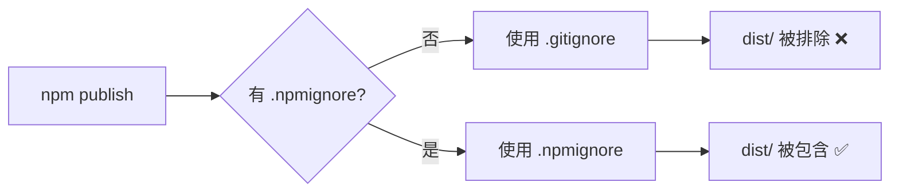

# npm-package-fix

## Purpose

superSpec 的 npm 发布包缺少编译产物（dist/ 目录），导致用户安装后 init 命令无法正常工作。根因是 .gitignore 排除了 dist/，而项目没有 .npmignore 文件，npm 回退使用 .gitignore 进行排除。需要建立正确的 npm 发布配置，确保发布包包含所有必要的运行时文件，同时排除开发文件。

<!-- DIAGRAM:flowchart -->

## Requirements

### Requirement: npm 发布包 MUST 包含编译产物
npm 发布的包 MUST 包含 dist/ 目录下的所有编译产物，包括 dist/index.js、dist/cli/index.js 和 dist/scripts/validate.js。这些文件是用户安装后运行 superspec 命令的必要文件。

#### Scenario: 用户安装后能正常运行 superspec --version
Given 用户通过 npm install -g @chenjazzyboss/superspec 安装了包
When 用户执行 superspec --version
Then 命令 MUST 输出当前版本号且不报错

#### Scenario: 用户安装后能正常运行 superspec init
Given 用户在项目目录中通过 npm install @chenjazzyboss/superspec 安装了包
When 用户执行 npx superspec init
Then MUST 创建 .superspec/ 目录结构，且 .superspec/scripts/validate.js 文件 MUST 存在

#### Scenario: npm pack 输出 MUST 包含 dist/ 目录
Given 项目源码处于干净状态
When 执行 npm pack --dry-run
Then 输出 MUST 包含 dist/index.js 和 dist/scripts/validate.js

### Requirement: npm 发布包 MUST 排除开发文件
npm 发布的包 MUST 排除源码（src/）、测试文件（test/）、开发配置（tsconfig.json、vitest.config.ts 等）、CI 配置（.github/）和 superSpec 自身的配置（.superspec/、.claude/）。这些文件对用户无用且增加包体积。

#### Scenario: npm pack 输出 MUST NOT 包含开发文件
Given 项目源码处于干净状态
When 执行 npm pack --dry-run
Then 输出 MUST NOT 包含 src/、test/、.github/、.superspec/、tsconfig.json 等开发文件

#### Scenario: npm 包体积 MUST 合理
Given 项目编译产物已生成
When 执行 npm pack
Then 生成的 tgz 文件大小 MUST 小于 500KB

### Requirement: 构建流程 MUST 在发布前自动执行
CI 发布流程 MUST 在 npm publish 之前自动运行 build 和 bundle-validate，确保 dist/ 目录中的文件是最新编译产物。

#### Scenario: CI release workflow 自动构建并发布
Given 代码推送到 main 分支且版本号发生变化
When release workflow 执行到 npm publish 步骤
Then MUST 已经执行过 npm run build 和 npm run bundle-validate，且 dist/scripts/validate.js 存在

#### Scenario: 本地 npm publish 前 MUST 自动构建
Given 开发者在本地执行 npm publish
When npm 的 prepare 或 prepublishOnly 钩子触发
Then MUST 自动执行 build 和 bundle-validate，确保 dist/ 目录包含最新产物

### Requirement: 本地开发流程 MUST 不受影响
.gitignore MUST 继续排除 dist/ 目录，本地开发时 dist/ 不会被提交到 git 仓库。.npmignore 的存在 MUST NOT 影响本地开发、测试和构建流程。

#### Scenario: 本地 git status 不包含 dist/
Given 开发者执行了 npm run build
When 执行 git status
Then dist/ 目录 MUST NOT 出现在未跟踪或已修改文件列表中

#### Scenario: 本地测试流程正常
Given 开发者执行 npm run build && npm run bundle-validate
When 执行 npm test
Then 所有测试 MUST 通过
