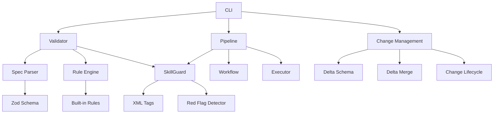

# CLAUDE.md

This file provides guidance to Claude Code (claude.ai/code) when working with code in this repository.

## 项目概述

superSpec 是一个 AI-Native 的规格说明书管理工具，用于 Claude Code 环境。它通过强制结构化规格说明书（spec）的存在，弥合人类意图与 AI 生成代码之间的鸿沟。

**核心价值**：
- 程序化校验 — Zod + 规则引擎，确定性输出
- 反幻觉系统 — SkillGuard 程序化检测，防止 AI 跳步
- 精简技能 — 11 个技能，总计 1193 行，AI 读得完、记得住
- CI 集成 — CLI + JSON 输出 + GitHub Actions

**解决的问题**：
当你告诉 AI "添加批量导出" 时，AI 会做出假设（PDF 导出、不完整的错误处理、弱测试），因为 spec 只存在于你的脑海中。superSpec 创建结构化的、经过验证的 spec，然后用它来驱动实现和验证。

## 技术栈

- **语言**：TypeScript（strict mode）
- **运行时**：Node.js >= 20
- **构建工具**：esbuild
- **测试框架**：vitest（383 个测试）
- **核心依赖**：zod, commander, js-yaml

## 常用命令

### 构建与开发

```bash
# 构建项目
npm run build

# 类型检查
npm run typecheck

# 开发模式（watch）
npm run dev
```

### 测试

```bash
# 运行所有测试
npm test

# 运行单个测试
npx vitest run test/path/to/test.ts

# 运行单个测试（详细输出）
npx vitest run test/path/to/test.ts --reporter verbose

# 运行测试并生成覆盖率报告
npx vitest run --coverage
```

### CLI 命令

```bash
# 初始化 superSpec
npx superspec init

# 校验 spec
npx superspec validate <spec-name>

# 检查技能配置
npx superspec guard <skill-path>

# 批量校验
npx superspec ci

# 生成测试代码
npx superspec generate <spec-name> -l typescript

# 路由评估
npx superspec route "add export"

# 管道执行
npx superspec pipeline run <spec-name>

# 变更管理
npx superspec change create <name>
npx superspec change apply <name>

# 历史记录
npx superspec history <spec-name>
npx superspec diff <spec-name>

# 模块校验
npx superspec validate-modules <file>
```

## 项目结构

```
superSpec/
├── src/
│   ├── core/                    # 核心引擎
│   │   ├── spec-schema.ts       # Zod Schema 定义
│   │   ├── spec-parser.ts       # Markdown → Spec 解析器
│   │   ├── validator.ts         # 双层校验引擎
│   │   ├── config.ts            # 校验常量
│   │   ├── rules/               # 规则引擎
│   │   ├── anti-rationalization/# 反幻觉系统
│   │   ├── xml-tags/            # XML 标签系统
│   │   ├── delta-spec/          # Delta 增量变更
│   │   ├── pipeline/            # 管道系统
│   │   └── diagrams/            # 图表生成
│   ├── skills/                  # Claude Code 技能（11 个）
│   ├── adapters/                # 测试代码生成适配器
│   ├── cli/                     # CLI 入口
│   └── ci/                      # CI 集成
├── templates/                   # 模板文件
├── test/                        # 测试文件
└── bin/                         # CLI 可执行文件
```

## 架构概览

### 核心模块关系图



### 关键文件速查

| 模块 | 文件 | 说明 |
|------|------|------|
| Schema | `src/core/spec-schema.ts` | Zod Schema 定义 |
| 解析器 | `src/core/spec-parser.ts` | Markdown → Spec |
| 校验器 | `src/core/validator.ts` | 双层校验引擎 |
| 规则引擎 | `src/core/rules/engine.ts` | 规则执行器 |
| SkillGuard | `src/core/anti-rationalization/skill-guard.ts` | 反幻觉系统 |
| 管道 | `src/core/pipeline/workflow.ts` | 7 阶段 DAG |
| Delta | `src/core/delta-schema.ts` | 增量变更 Schema |
| 路由 | `src/core/route-evaluator.ts` | 意图检测与路径路由 |
| 图表 | `src/core/diagram-generator.ts` | Mermaid 图表生成 |
| 源码追踪 | `src/core/source-tracker.ts` | Spec 与源码链接 |

### 数据流

典型使用流程：
1. `superspec init` → 创建 `.superspec/` 目录结构和 `.claude/`
2. `superspec route "add export"` → 路由评估器分类意图并推荐路径
3. 轻量路径：spec 直接生成到 `.superspec/specs/<name>/spec.md`
4. 完整路径：创建变更目录，写入 Delta spec，然后合并
5. `superspec validate <name>` → 双层校验：Markdown → 解析 → Zod Schema → 11 条业务规则
6. `superspec pipeline run <name>` → 编排 7 阶段工作流，自动执行可程序化阶段
7. 每个管道阶段，PipelineGuardRunner 调用 SkillGuard 钩子防止 AI 幻觉

## 核心概念

### 1. 双层校验引擎

- **第一层**：Zod Schema 结构校验（parse 阶段）
- **第二层**：规则引擎业务校验（11 条内置规则）

**内置规则**：
- ERROR 级别：`require-shall`, `min-scenarios`, `unique-req-names`, `unique-scenario-names`
- WARNING 级别：`recommended-scenarios`, `no-vague-words`, `scenario-types`, `diagram-presence`, `scenario-type-classifier`
- INFO 级别：`overview-length`, `testability`

### 2. SkillGuard 反幻觉系统

- `beforeExecute()` — 检查红线表和 HARD-GATE
- `onOutput()` — 检测跳步模式和红线
- `onCompletion()` — 验证完成声明的证据
- `onSubagentDelegation()` — 检查 SUBAGENT-STOP 标签

### 3. XML 标签系统

- `<HARD-GATE>` — 不可绕过的执行门禁
- `<CHECKLIST>` — 检查清单
- `<EXTREMELY-IMPORTANT>` — 极端重要性声明
- `<SUBAGENT-STOP>` — 子代理停止标记

### 4. Delta 增量变更

- 支持 ADDED/REMOVED/MODIFIED/RENAMED 操作
- 拓扑排序执行，自动校验合并结果

### 5. 管道系统

**7 阶段 DAG**：
1. brainstorm（可选）— 头脑风暴
2. generate-spec — 生成 spec
3. validate-spec — 校验 spec
4. write-plan — 编写计划
5. implement — 实现
6. verify — 验证
7. archive — 归档

**特点**：
- 阶段隔离、状态持久化、可恢复
- 自动执行可程序化阶段（validate-spec, archive）
- AI 阶段输出操作指引

## 开发规范

### 代码风格

- 使用 TypeScript strict mode
- 函数和变量使用 camelCase
- 类型和接口使用 PascalCase
- 常量使用 UPPER_SNAKE_CASE

### 测试要求

- 每个新功能必须有测试
- 测试文件放在 `test/` 目录下
- 运行测试：`npm test`
- 测试覆盖率要求：80%+

### 测试编写指南

1. **测试文件位置**：`test/` 目录下，与源码结构对应
2. **命名规范**：`<module-name>.test.ts`
3. **测试结构**：使用 `describe`/`it`/`expect`（vitest）
4. **测试数据**：使用内联 Markdown spec 字符串
5. **测试模式**：
   - 单元测试：测试单个函数/类
   - 集成测试：测试模块间交互
   - E2E 测试：测试完整流程

### 提交规范

- 使用中文提交信息
- 格式：`功能(<范围>): <描述>` 或 `修复(<范围>): <描述>`
- 每个功能一个分支，合并回 main

### 调试技巧

1. **单测调试**：`npx vitest run test/path/to/test.ts --reporter verbose`
2. **类型检查**：`npm run typecheck`
3. **构建调试**：`npm run dev`（watch 模式）
4. **CLI 调试**：`node bin/superspec.js <command>`

### 常见问题

1. **测试失败**：检查 spec 格式是否符合 Zod Schema
2. **类型错误**：运行 `npm run typecheck` 检查
3. **构建失败**：检查 `tsconfig.json` 配置
4. **CLI 命令不识别**：确保已运行 `npm run build`

## 设计原则

### 核心理念

1. **确定性优先** — 程序做确定性检查，AI 做判断性检查
2. **精简技能** — 技能文件要精简，参考材料放 references/
3. **证据驱动** — 完成声明必须附带证据
4. **防御性设计** — 多级门控，防止 AI 跳步
5. **可扩展性** — 核心不可改，外围可替换

### 设计决策

1. **为什么用 Zod？** — 类型安全 + 运行时校验 + 自动推导
2. **为什么用规则引擎？** — 可扩展、可配置、可测试
3. **为什么用管道？** — 阶段隔离、状态持久化、可恢复
4. **为什么用 Delta？** — 增量更新，避免全量重跑

### 扩展点

1. **自定义规则**：在 `src/core/rules/builtin/` 添加新规则
2. **自定义适配器**：在 `src/adapters/` 添加新语言适配器
3. **自定义管道阶段**：在 `src/core/pipeline/workflow.ts` 添加新阶段
4. **自定义 XML 标签**：在 `src/core/xml-tags/` 添加新标签引擎
5. **自定义图表**：在 `src/core/diagrams/` 添加新图表类型

## 配置说明

### 配置文件位置

- **全局配置**：`~/.superspec/config.yaml`
- **项目配置**：`.superspec/config.yaml`
- **变更配置**：`.superspec/changes/<name>/config.yaml`

### 配置优先级

变更配置 > 项目配置 > 全局配置

### 配置示例

```yaml
# .superspec/config.yaml
language: typescript
strict: true
template: general
ci:
  enabled: true
  strictMode: false
```

## 附录

### CLI 命令完整列表

| 命令 | 说明 | 示例 |
|------|------|------|
| `init` | 初始化项目 | `superspec init` |
| `validate` | 校验 spec | `superspec validate my-spec` |
| `generate` | 生成测试代码 | `superspec generate my-spec -l typescript` |
| `update` | 增量更新 spec | `superspec update my-spec -f delta.json` |
| `ci` | 批量校验 | `superspec ci` |
| `diff` | 对比版本 | `superspec diff my-spec` |
| `history` | 查看历史 | `superspec history my-spec` |
| `archive` | 归档变更 | `superspec archive my-change` |
| `changes` | 列出变更 | `superspec changes` |
| `guard` | 检查技能配置 | `superspec guard skill.md` |
| `uninstall` | 卸载 superSpec | `superspec uninstall` |
| `validate-modules` | 校验模块清单 | `superspec validate-modules modules.md` |
| `pipeline show` | 显示工作流 | `superspec pipeline show` |
| `pipeline next` | 查询下一步 | `superspec pipeline next validate-spec` |
| `pipeline run` | 运行管道 | `superspec pipeline run my-spec` |
| `pipeline status` | 查看状态 | `superspec pipeline status my-spec` |
| `pipeline list` | 列出执行记录 | `superspec pipeline list` |
| `pipeline resume` | 恢复执行 | `superspec pipeline resume exec-id` |
| `change create` | 创建变更 | `superspec change create my-change` |
| `change status` | 查询变更状态 | `superspec change status my-change` |
| `change apply` | 应用变更 | `superspec change apply my-change` |
| `change list` | 列出变更 | `superspec change list` |
| `route` | 路由评估 | `superspec route "add export"` |

### 错误代码

| 代码 | 说明 |
|------|------|
| `SPEC_NOT_FOUND` | Spec 文件不存在 |
| `INVALID_SPEC` | Spec 格式不正确 |
| `VALIDATION_FAILED` | 校验失败 |
| `DELTA_MERGE_FAILED` | Delta 合并失败 |
| `PIPELINE_STAGE_FAILED` | 管道阶段执行失败 |
| `CHANGE_NOT_FOUND` | 变更不存在 |
| `MODULE_VALIDATION_FAILED` | 模块校验失败 |
