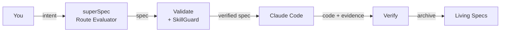
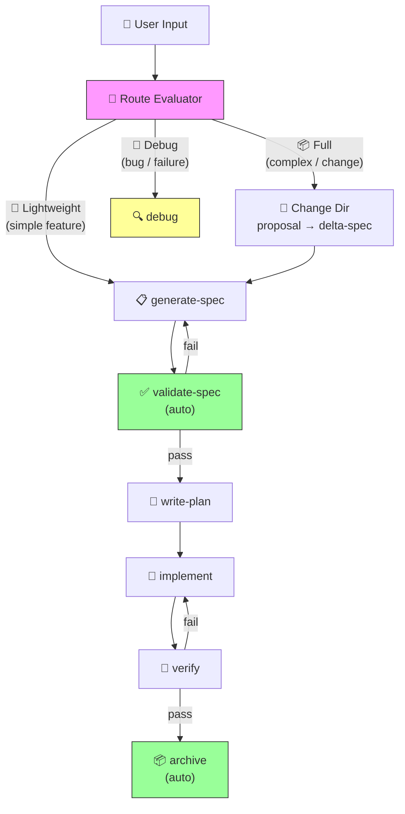

<div align="center">

# superSpec

**AI-native spec management for Claude Code.**

Turn natural language into executable specifications. Catch AI hallucinations before they become bugs.

[](LICENSE)
[]()
[]()

English | [中文](./README.zh-CN.md)

</div>

---

## The problem

You tell Claude Code: *"Add batch export to the system."*

It writes 500 lines of code. Tests pass. You merge.

Three days later you discover:
- PDF export was never mentioned but Claude assumed it
- Error handling covers 2 of 7 failure modes
- The "edge case" tests are actually happy-path tests with different data

**The spec was in your head. Claude couldn't see it.**

## The solution

superSpec sits between your intent and Claude's code. It forces a structured spec to exist *before* any code is written, then validates that the code actually matches.



## Quick start

```bash
# 1. Clone and build superspec
git clone https://github.com/ChenJazzyBoss/superSpec.git
cd superSpec
npm install
npm run build
npm run bundle-validate

# 2. Go to YOUR project and initialize
cd /path/to/your-project
node /path/to/superSpec/bin/superspec.js init
```

This creates `.superspec/` and `.claude/` in your project. Then in Claude Code:

```
/generate-spec
```

Claude will ask you questions, generate a structured spec, and validate it — before writing any code.

## What it does

📋 **Structured specs** — Requirements use SHALL/MUST, scenarios use Given/When/Then. No ambiguity.

✅ **Auto-validation** — 9 built-in rules catch missing scenarios, vague words, and incomplete coverage.

🔍 **Deep analysis** — Optional `--deep` mode detects logical contradictions between scenarios and coverage gaps in requirements.

📊 **Auto diagrams** — Add `<!-- DIAGRAM:flowchart -->` to your spec, and Mermaid diagrams are generated and embedded automatically.

🔗 **Source tracking** — Add `<!-- source: src/foo.ts -->` to link specs to code. Get warned when source files change but spec doesn't.

🏷️ **Scenario classification** — Scenarios are auto-tagged as normal/error/boundary. Missing error scenarios trigger warnings.

🔄 **Delta changes** — Describe what changed, not the whole file. Merge conflicts become impossible.

🛡️ **Anti-hallucination** — Red flag tables and checklists prevent Claude from skipping steps or faking completion.

🔍 **SkillGuard** — Programmatic detection of AI skip patterns. Run `superspec guard` to verify skill configuration.

📋 **Init Template** — Collect human context before spec generation. Solves the "AI can't read your mind" problem.

📦 **Multi-artifact validation** — Validate module lists with `superspec validate-modules`. Circular dependency detection included.

🤖 **Subagent orchestration** — Dual-review pipeline: implement → spec-check → code-review. Every task.

## CLI Commands

### `superspec init`

Initialize superSpec in your project.

```bash
superspec init                  # Default setup
superspec init --interactive    # Interactive configuration
superspec init --ci             # Include GitHub Actions workflow
superspec init --template web-api   # Use Web API template
superspec init --list-templates     # List available templates
```

Creates `.superspec/` directory structure, injects `CLAUDE.md`, copies templates and scripts.

### `superspec validate <spec>`

Validate a spec file.

```bash
superspec validate batch-export              # By spec name
superspec validate .superspec/specs/batch-export/spec.md  # By file path
superspec validate batch-export --strict     # WARNING = failure
superspec validate batch-export --deep       # Logical consistency analysis
```

Output (JSON):
```json
{
  "valid": true,
  "issues": [],
  "summary": { "errors": 0, "warnings": 0, "info": 0 },
  "scenarioTypes": {
    "requirements[0]": ["normal", "error", "boundary"]
  }
}
```

### `superspec ci`

Batch validate all specs.

```bash
superspec ci              # Validate all specs
superspec ci --strict     # Strict mode
superspec ci --json       # JSON output
```

### `superspec generate <name>`

Generate test code skeleton from spec.

```bash
superspec generate batch-export                          # TypeScript (default)
superspec generate batch-export -l python                # Python
superspec generate batch-export -o test/batch.test.ts    # Write to file
```

### `superspec update <name>`

Incrementally update a spec via Delta JSON.

```bash
cat delta.json | superspec update batch-export
superspec update batch-export -f delta.json
```

### `superspec diff <name>`

Compare current spec with historical version.

```bash
superspec diff batch-export                    # Compare with latest snapshot
superspec diff batch-export --from 2026-06-01  # Compare with specific version
```

### `superspec history <name>`

List all historical snapshots of a spec.

```bash
superspec history batch-export
```

### `superspec archive <name>`

Archive a completed change.

```bash
superspec archive add-pdf-export
```

### `superspec changes`

List in-progress changes.

```bash
superspec changes
```

### `superspec guard`

Check skill file's anti-hallucination configuration.

```bash
superspec guard src/skills/generate-spec/SKILL.md    # Check skill config
superspec guard src/skills/validate-spec/SKILL.md --json  # JSON output
```

Verifies that skill files have proper red flag tables and HARD-GATE tags configured.

### `superspec validate-modules`

Validate module list files.

```bash
superspec validate-modules modules.md                    # Validate module list
superspec validate-modules modules.md -p my-project      # With project name
superspec validate-modules modules.md --json             # JSON output
```

Checks module structure, detects circular dependencies, validates naming conventions.

### `superspec pipeline show`

Display the default workflow definition.

```bash
superspec pipeline show
```

Output:
```
📋 superSpec 默认工作流

  阶段              类型     依赖
  ──────────────── ──────── ──────────────────
  brainstorm        可选     —
  generate-spec     必需     brainstorm
  validate-spec     必需     generate-spec
  write-plan        必需     validate-spec
  implement         必需     write-plan
  verify            必需     implement
  archive           必需     verify
```

### `superspec pipeline next <stage>`

Query the recommended next step for a given stage.

```bash
superspec pipeline next brainstorm        # → generate-spec
superspec pipeline next validate-spec     # → write-plan
superspec pipeline next archive           # → "reached end of workflow"
```

### `superspec pipeline run <name>`

Run the pipeline for a spec — auto-executes programmatic stages (validate-spec, archive) and outputs guidance for AI stages.

```bash
superspec pipeline run batch-export                     # Run from validate-spec
superspec pipeline run batch-export --from write-plan   # Resume from a specific stage
```

Execution records are persisted to `.superspec/pipeline/<exec-id>.json`.

### `superspec pipeline status [name]`

View pipeline execution status.

```bash
superspec pipeline status               # Latest execution
superspec pipeline status batch-export  # Latest for this spec
superspec pipeline status --exec <id>   # By execution id
```

### `superspec pipeline list`

List all pipeline execution records.

```bash
superspec pipeline list
```

### `superspec pipeline resume <exec-id>`

Resume a failed pipeline execution from the failed stage.

```bash
superspec pipeline resume batch-export-20260611100000
```

### `superspec change`

Manage change lifecycle (unified model for new features and modifications).

```bash
superspec change create <name>             # Create change directory with proposal
superspec change create <name> --why "..." # With description
superspec change list                      # List all changes
superspec change status <name>             # Show change phase and capabilities
superspec change apply <name>              # Merge delta specs into main specs
superspec change apply <name> --dry-run    # Validate without writing
```

### `superspec route`

Evaluate user intent and recommend a path.

```bash
superspec route "add export button"          # → 🚀 Lightweight
superspec route "implement full auth" -c 3   # → 📦 Full
superspec route "modify export format"       # → 📦 Full (modification)
superspec route "export feature crashed"     # → 🔧 Debug
```

### `superspec uninstall`

Remove all superSpec files from project.

```bash
superspec uninstall        # With confirmation
superspec uninstall -y     # Skip confirmation
```

## Spec Format

A spec file uses structured Markdown:

```markdown
# Feature Name

## Purpose

Description of what this feature does and why it's needed.
Must be at least 50 characters.

<!-- DIAGRAM:flowchart -->

## Requirements

### Requirement: Requirement Name
The system SHALL do something specific.

#### Scenario: Normal flow
Given some precondition
When some action
Then expected result

#### Scenario: Exception handling
Given some precondition
When an error occurs
Then error is handled gracefully

#### Scenario: Boundary condition
Given edge case data
When processing
Then system handles correctly
```

### Spec Annotations

| Annotation | Purpose | Example |
|------------|---------|---------|
| `<!-- DIAGRAM:flowchart -->` | Auto-generate flowchart | Embedded after validation |
| `<!-- DIAGRAM:state -->` | Auto-generate state diagram | Embedded after validation |
| `<!-- source: path -->` | Link to source code | `<!-- source: src/core/foo.ts -->` |

## How it works

### 1. Generate a spec

```
/superspec:generate-spec
```

Claude asks about your requirements, then produces:

```markdown
# Batch Export

## Purpose
System needs to export data in CSV, XLSX, and PDF formats
for various business workflows...

## Requirements

### Requirement: Format Support
System SHALL support CSV, XLSX, and PDF export formats.

#### Scenario: Normal flow - CSV export
Given user is on the data list page
When selecting CSV format and clicking export
Then system generates and downloads a CSV file

#### Scenario: Exception - Export failure
Given user is on the data list page
When an error occurs during export
Then system displays error message and logs the issue
```

### 2. Validate

```bash
# Basic validation (format + rules + scenario classification)
node .superspec/scripts/validate.js .superspec/specs/batch-export/spec.md

# Deep validation (+ logical consistency analysis)
node .superspec/scripts/validate.js .superspec/specs/batch-export/spec.md --deep
```

```
✅ valid: true
   errors: 0, warnings: 0, info: 0

   scenarioTypes:
     requirements[0]: [normal, error, boundary]
```

### 3. Implement

```
/superspec:write-plan
/superspec:subagent-dev
```

Claude creates a detailed plan, then implements each task with dual review.

### 4. Run the pipeline

```bash
superspec pipeline run batch-export
```

Automatically executes programmatic stages (validate-spec, archive) and guides you through AI stages (write-plan, implement, verify). Execution state is persisted — you can resume anytime.

### 5. Archive

```
/superspec:archive
```

Changes are recorded. Specs grow. History is preserved.

## Features

| Feature | What it means |
|---------|---------------|
| 📋 **Spec generation** | Natural language → structured spec with validation |
| ✅ **9 validation rules** | Catches missing SHALL, vague words, incomplete scenarios |
| 🔍 **Deep analysis** | `--deep` mode: logical contradiction detection, coverage gap analysis |
| 📊 **Auto diagrams** | `<!-- DIAGRAM:flowchart/state -->` → Mermaid diagrams embedded automatically |
| 🔗 **Source tracking** | `<!-- source: path -->` → warns when code changes but spec doesn't |
| 🏷️ **Scenario classification** | Auto-tags normal/error/boundary scenarios, warns on missing error cases |
| 🔄 **Delta merge** | Incremental spec changes, no full-file rewrites |
| 🛡️ **Anti-hallucination** | Red flags, checklists, evidence verification |
| 🔍 **SkillGuard** | Programmatic detection of AI skip patterns |
| 📋 **Init Template** | Collect human context before spec generation, 4 project-type templates (general/web-api/cli/library) |
| 📦 **Multi-artifact validation** | Module list validation with circular dependency detection |
| 🤖 **Subagent pipeline** | Implement → spec-check → code-review per task |
| 🔀 **Skill pipeline** | 7-stage DAG workflow with pre/post conditions, context passing, and retry |
| 🚀 **Pipeline run** | `pipeline run/status/list/resume` — auto-execute programmatic stages, persist execution records, resume from failures |
| 📂 **Unified change model** | Change directory with proposal → delta spec → apply lifecycle (inspired by OpenSpec) |
| 🧭 **Central router** | Brainstorm skill routes new features to unified pipeline, bugs to debug path (inspired by cospowers) |
| 🔄 **Specs apply engine** | Merge delta specs (ADDED/MODIFIED/REMOVED/RENAMED) into main specs with dry-run validation |
| 🛡️ **PipelineGuardRunner** | SkillGuard hooks integrated into pipeline execution: beforeExecute, onOutput, onCompletion |
| 🧭 **Skill routing** | Every skill has a "Next Step" section, queryable via `pipeline next` |
| ⚙️ **Config layers** | Global → project → change, with priority merge |
| 📦 **Archive system** | Full change lifecycle: draft → in-progress → review → done |
| 🧪 **Test generation** | TypeScript (vitest) and Python (pytest) skeletons |
| 🔌 **CI integration** | GitHub Actions workflow for PR validation |

## Why superSpec?

| | Traditional spec tools | superSpec |
|---|---|---|
| **When** | Written after code | Written before code |
| **Format** | Word docs, Confluence | Structured Markdown with validation |
| **Enforcement** | Honor system | Programmatic rules, 0 tolerance |
| **AI awareness** | None | Built for Claude Code workflows |
| **Change tracking** | Full file rewrites | Delta merge with conflict detection |
| **Verification** | "Looks good to me" | Evidence-driven, must run commands |

## The workflow



Three adaptive paths based on complexity assessment. Programmatic stages (validate-spec, archive) run automatically via `pipeline run`. AI stages output guidance and wait for completion.

### Running the pipeline

Use `superspec pipeline run` to automate the workflow:

```bash
# Start pipeline (auto-runs validate-spec)
superspec pipeline run batch-export

# Output shows stage status + next step guidance
# 📋 管道执行: batch-export-20260611100000
#    ✅ validate-spec     completed   (150ms)
#    ⏳ write-plan        pending     — needs AI
#
# 📍 下一步操作指引:
#    阶段: write-plan
#    技能: write-plan
#    操作: 计划生成后，运行 superspec pipeline run <name> --from implement 继续管道

# After AI completes write-plan, resume pipeline
superspec pipeline run batch-export --from implement

# Check pipeline status anytime
superspec pipeline status batch-export
```

Programmatic stages (validate-spec, archive) run automatically. AI stages output guidance and wait for completion.

### PipelineGuardRunner

The pipeline integrates SkillGuard at runtime. Every stage execution goes through anti-hallucination checks:

```
Stage starts → SkillGuard.beforeExecute() → check red flag table & HARD-GATE
Stage runs   → handler(context)
Stage output → SkillGuard.onOutput()      → detect skip patterns & red flags
Stage ends   → SkillGuard.onCompletion()  → verify evidence
```

If a skill file lacks a red flag table, the stage is **blocked** — not warned, blocked.

## Anti-hallucination design

Every high-risk skill has:

**Red flag table** — Common excuses and why they're wrong:
| Excuse | Reality |
|--------|---------|
| "Should be fine" | Run the verification command |
| "Subagent said it's done" | Subagents hallucinate completion |
| "Tests passed before" | Before ≠ now |

**Completion checklist** — Must check every box before declaring done:
- [ ] Verification command actually ran
- [ ] Full output read, exit code checked
- [ ] Zero failures

**XML tag constraints** — Behavioral guards in skill definitions:
```xml
<HARD-GATE>
No fresh evidence = no completion claim. No exceptions.
</HARD-GATE>
```

## Project structure

```
superSpec/
├── bin/superspec.js          # CLI entry point
├── CLAUDE.md                 # Project AI behavior guide
├── src/
│   ├── cli/index.ts          # CLI commands
│   ├── core/
│   │   ├── validator.ts      # Validation engine
│   │   ├── spec-parser.ts    # Markdown parser
│   │   ├── spec-schema.ts    # Zod schemas
│   │   ├── module-schema.ts  # Module list schemas
│   │   ├── module-parser.ts  # Module list parser
│   │   ├── module-validator.ts # Module list validator
│   │   ├── deep-analysis.ts  # Logical consistency check
│   │   ├── diagram-generator.ts  # Auto Mermaid diagrams
│   │   ├── source-tracker.ts # Spec-code sync tracking
│   │   ├── delta-merge.ts    # Incremental spec updates
│   │   ├── change-lifecycle.ts   # Change directory management
│   │   ├── delta-spec-parser.ts  # Markdown delta spec parser
│   │   ├── specs-apply.ts    # Delta → main spec merge engine
│   │   ├── route-evaluator.ts    # Intent detection & path routing
│   │   ├── anti-rationalization/ # SkillGuard system
│   │   ├── pipeline/         # Skill orchestration pipeline
│   │   │   ├── executor.ts   # Pipeline execution engine
│   │   │   ├── runner.ts     # CLI runtime (run/status/list/resume)
│   │   │   ├── guard-runner.ts   # SkillGuard integration
│   │   │   ├── context.ts    # Stage-to-stage context passing
│   │   │   ├── conditions.ts # Pre/post condition checks
│   │   │   ├── retry.ts      # Failure classification & retry
│   │   │   └── workflow.ts   # Default 7-stage DAG definition
│   │   ├── rules/            # Validation rules
│   │   ├── diagrams/         # Diagram generators
│   │   └── config/           # Configuration system
│   ├── adapters/             # Test code generators
│   └── ci/                   # CI runner
├── templates/                # Project templates
│   ├── spec-template.md      # Spec scaffold
│   ├── init-spec-template.md # Init Template for context collection
│   ├── change/               # Change lifecycle templates
│   └── init-templates/       # Project-type templates
│       ├── general.md        # General project
│       ├── web-api.md        # Web API project
│       ├── cli.md            # CLI tool project
│       └── library.md        # Library/SDK project
├── test/                     # Test suite (558 tests)
└── dist/                     # Build output
```

## Acknowledgments

superSpec stands on the shoulders of two excellent projects:

**[OpenSpec](https://github.com/openspec-dev/openspec)** — The specs/changes/archive directory model and behavior contract spec format were directly inspired by OpenSpec's approach to structured specification management. Their insight that "specs are living documents, not one-time artifacts" shaped superSpec's core architecture.

**[superpowers-zh](https://github.com/superpowers-dev/superpowers-zh)** — The runtime behavioral constraints (XML tags, anti-hallucination patterns, subagent orchestration) were influenced by superpowers-zh's methodology for controlling AI agent behavior during coding sessions.

Thank you both for open-sourcing your ideas. 🙏

## Contributing

Found a bug? [Open an issue](../../issues).

Want to contribute? Fork, branch, PR. All contributions welcome.

Have ideas? Start a [discussion](../../discussions).

## License

MIT
