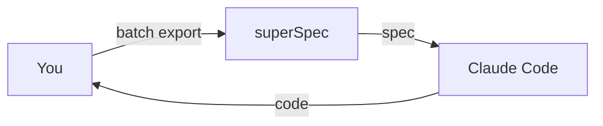
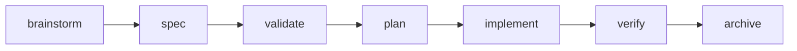

<div align="center">

# superSpec

**AI-native spec management for Claude Code.**

Turn natural language into executable specifications. Catch AI hallucinations before they become bugs.

[](LICENSE)
[]()
[]()

English | [中文](./README.zh-CN.md)

</div>

---

## The problem

You tell Claude Code: *"Add batch export to the system."*

It writes 500 lines of code. Tests pass. You merge.

Three days later you discover:
- PDF export was never mentioned but Claude assumed it
- Error handling covers 2 of 7 failure modes
- The "edge case" tests are actually happy-path tests with different data

**The spec was in your head. Claude couldn't see it.**

## The solution

superSpec sits between your intent and Claude's code. It forces a structured spec to exist *before* any code is written, then validates that the code actually matches.



## Quick start

```bash
# Clone and build
git clone <repo-url> superspec && cd superspec
npm install && npm run build

# Initialize in your project
node bin/superspec.js init
```

This creates `.superspec/` and `.claude/` in your project. Then in Claude Code:

```
/superspec:generate-spec
```

Claude will ask you questions, generate a structured spec, and validate it — before writing any code.

## What it does

📋 **Structured specs** — Requirements use SHALL/MUST, scenarios use Given/When/Then. No ambiguity.

✅ **Auto-validation** — 9 built-in rules catch missing scenarios, vague words, and incomplete coverage.

🔄 **Delta changes** — Describe what changed, not the whole file. Merge conflicts become impossible.

📊 **Mermaid diagrams** — Auto-generated flowcharts, state diagrams, and test coverage matrices.

🛡️ **Anti-hallucination** — Red flag tables and checklists prevent Claude from skipping steps or faking completion.

🤖 **Subagent orchestration** — Dual-review pipeline: implement → spec-check → code-review. Every task.

## How it works

### 1. Generate a spec

```
/superspec:generate-spec
```

Claude asks about your requirements, then produces:

```markdown
# Batch Export

## Purpose
System needs to export data in CSV, XLSX, and PDF formats
for various business workflows...

## Requirements

### Requirement: Format Support
System SHALL support CSV, XLSX, and PDF export formats.

#### Scenario: Normal flow - CSV export
Given user is on the data list page
When selecting CSV format and clicking export
Then system generates and downloads a CSV file

#### Scenario: Exception - Export failure
Given user is on the data list page
When an error occurs during export
Then system displays error message and logs the issue
```

### 2. Validate

```bash
node .superspec/scripts/validate.js .superspec/specs/batch-export/spec.md
```

```
✅ valid: true
   errors: 0, warnings: 0, info: 0
```

### 3. Implement

```
/superspec:write-plan
/superspec:subagent-dev
```

Claude creates a detailed plan, then implements each task with dual review.

### 4. Archive

```
/superspec:archive
```

Changes are recorded. Specs grow. History is preserved.

## Features

| Feature | What it means |
|---------|---------------|
| 📋 **Spec generation** | Natural language → structured spec with validation |
| ✅ **9 validation rules** | Catches missing SHALL, vague words, incomplete scenarios |
| 🔄 **Delta merge** | Incremental spec changes, no full-file rewrites |
| 📊 **Mermaid diagrams** | Auto-generated flowcharts and state diagrams |
| 🛡️ **Anti-hallucination** | Red flags, checklists, evidence verification |
| 🤖 **Subagent pipeline** | Implement → spec-check → code-review per task |
| ⚙️ **Config layers** | Global → project → change, with priority merge |
| 🔍 **Upstream tracking** | Detect drift from OpenSpec/superpowers-zh patterns |
| 📦 **Archive system** | Full change lifecycle: draft → in-progress → review → done |
| 🧪 **Test generation** | TypeScript (vitest) and Python (pytest) skeletons |
| 🔌 **CI integration** | GitHub Actions workflow for PR validation |

## Why superSpec?

| | Traditional spec tools | superSpec |
|---|---|---|
| **When** | Written after code | Written before code |
| **Format** | Word docs, Confluence | Structured Markdown with validation |
| **Enforcement** | Honor system | Programmatic rules, 0 tolerance |
| **AI awareness** | None | Built for Claude Code workflows |
| **Change tracking** | Full file rewrites | Delta merge with conflict detection |
| **Verification** | "Looks good to me" | Evidence-driven, must run commands |

## The workflow



Each stage has pre-conditions, post-conditions, and retry strategies. The pipeline is deterministic — not vibes.

## Anti-hallucination design

Every high-risk skill has:

**Red flag table** — Common excuses and why they're wrong:
| Excuse | Reality |
|--------|---------|
| "Should be fine" | Run the verification command |
| "Subagent said it's done" | Subagents hallucinate completion |
| "Tests passed before" | Before ≠ now |

**Completion checklist** — Must check every box before declaring done:
- [ ] Verification command actually ran
- [ ] Full output read, exit code checked
- [ ] Zero failures

**XML tag constraints** — Behavioral guards in skill definitions:
```xml
<HARD-GATE>
No fresh evidence = no completion claim. No exceptions.
</HARD-GATE>
```

## Acknowledgments

superSpec stands on the shoulders of two excellent projects:

**[OpenSpec](https://github.com/openspec-dev/openspec)** — The specs/changes/archive directory model and behavior contract spec format were directly inspired by OpenSpec's approach to structured specification management. Their insight that "specs are living documents, not one-time artifacts" shaped superSpec's core architecture.

**[superpowers-zh](https://github.com/superpowers-dev/superpowers-zh)** — The runtime behavioral constraints (XML tags, anti-hallucination patterns, subagent orchestration) were influenced by superpowers-zh's methodology for controlling AI agent behavior during coding sessions.

Thank you both for open-sourcing your ideas. 🙏

## Contributing

Found a bug? [Open an issue](../../issues).

Want to contribute? Fork, branch, PR. All contributions welcome.

Have ideas? Start a [discussion](../../discussions).

## License

MIT
