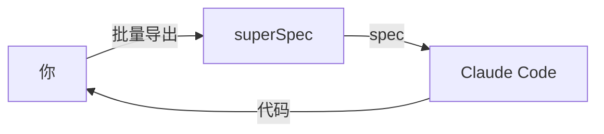

<div align="center">

# superSpec

**专为 Claude Code 设计的 AI 原生规格说明书管理工具。**

把自然语言变成可执行的规格说明书。在 AI 幻觉变成 bug 之前就抓住它。

[](LICENSE)
[]()
[]()

[English](./README.md) | 中文

</div>

---

## 你是否遇到过这种情况？

你告诉 Claude Code：*"给系统加个批量导出功能。"*

它写了 500 行代码。测试通过了。你合并了。

三天后你发现：
- PDF 导出从没提过，但 Claude 自己"脑补"了
- 错误处理只覆盖了 7 种失败模式中的 2 种
- "边界条件"测试其实是换了数据的正常流程测试

**需求在你脑子里，Claude 看不见。**

## superSpec 怎么解决

superSpec 卡在你的意图和 Claude 的代码之间。它强制要求在写代码*之前*先有一份结构化的规格说明书，然后校验代码是否真的匹配。



## 快速开始

```bash
# 1. 克隆并构建 superspec
git clone https://github.com/ChenJazzyBoss/superSpec.git
cd superSpec
npm install && npm run build

# 2. 进入你的项目，执行初始化
cd /path/to/your-project
node /path/to/superSpec/bin/superspec.js init
```

这会在你的项目中创建 `.superspec/` 和 `.claude/`。然后在 Claude Code 中：

```
/generate-spec
```

Claude 会问你问题，生成结构化的 spec，然后校验——在写任何代码之前。

## 它能做什么

📋 **结构化 spec** — 需求用 SHALL/MUST，场景用 Given/When/Then。没有歧义。

✅ **自动校验** — 9 条内置规则，抓缺失场景、模糊词汇、不完整覆盖。

🔄 **Delta 变更** — 只描述改了什么，不用重写整个文件。合并冲突不可能发生。

📊 **Mermaid 图表** — 自动生成流程图、状态图、测试覆盖矩阵。

🛡️ **反幻觉设计** — 红线表和检查清单，防止 Claude 跳步或伪造完成。

🤖 **子代理编排** — 每个任务双重 review：实现 → spec 审查 → 代码审查。

## 工作原理

### 1. 生成 spec

```
/generate-spec
```

Claude 问你需求，然后输出：

```markdown
# 批量导出

## Purpose
系统需要支持将数据批量导出为 CSV、XLSX、PDF 格式，
满足不同业务场景下的数据流转需求。

## Requirements

### Requirement: 格式支持
系统 SHALL 支持 CSV、XLSX 和 PDF 三种导出格式。

#### Scenario: 正常流程-CSV 导出
Given 用户在数据列表页面
When 选择 CSV 格式并点击导出
Then 系统生成 CSV 文件并下载

#### Scenario: 异常场景-导出失败
Given 用户在数据列表页面
When 导出过程中发生错误
Then 系统显示错误提示并记录日志
```

### 2. 校验

```bash
node .superspec/scripts/validate.js .superspec/specs/batch-export/spec.md
```

```
✅ valid: true
   errors: 0, warnings: 0, info: 0
```

### 3. 实现

```
/write-plan
/subagent-dev
```

Claude 创建详细计划，然后每个任务双重 review 实现。

### 4. 归档

```
/archive
```

变更被记录。Spec 持续增长。历史被保留。

## 功能列表

| 功能 | 说明 |
|------|------|
| 📋 **Spec 生成** | 自然语言 → 结构化 spec + 校验 |
| ✅ **9 条校验规则** | 抓缺失 SHALL、模糊词、不完整场景 |
| 🔄 **Delta 合并** | 增量 spec 变更，不用全量重写 |
| 📊 **Mermaid 图表** | 自动生成流程图和状态图 |
| 🛡️ **反幻觉设计** | 红线表、检查清单、证据验证 |
| 🤖 **子代理管道** | 每任务：实现 → spec 审查 → 代码审查 |
| ⚙️ **配置分层** | 全局 → 项目 → 变更，优先级合并 |
| 🔍 **上游追踪** | 检测与 OpenSpec/superpowers-zh 的偏差 |
| 📦 **归档系统** | 完整生命周期：草稿 → 进行中 → 审查 → 完成 |
| 🧪 **测试生成** | TypeScript (vitest) 和 Python (pytest) 骨架 |
| 🔌 **CI 集成** | GitHub Actions PR 校验工作流 |

## 为什么选 superSpec？

| | 传统 spec 工具 | superSpec |
|---|---|---|
| **什么时候写** | 代码写完后补 | 代码写之前 |
| **格式** | Word 文档、Confluence | 结构化 Markdown + 校验 |
| **执行方式** | 靠自觉 | 程序化规则，零容忍 |
| **AI 感知** | 无 | 专为 Claude Code 设计 |
| **变更追踪** | 全量重写文件 | Delta 合并 + 冲突检测 |
| **验证** | "看起来没问题" | 证据驱动，必须跑命令 |

## 完整工作流


每个阶段有前置条件、后置条件、重试策略。管道是确定性的——不是靠感觉。

## 反幻觉设计

每个高风险技能都包含：

**红线表** — 常见借口和为什么是错的：
| 借口 | 现实 |
|------|------|
| "应该没问题了" | 跑验证命令 |
| "子代理说完成了" | 子代理会幻觉完成 |
| "之前测试通过了" | 之前 ≠ 现在 |

**完成检查清单** — 每项都打勾才能宣布完成：
- [ ] 验证命令真的跑了
- [ ] 完整输出已读，退出码已检查
- [ ] 失败数量为 0

**XML 标签约束** — 技能定义中的行为守卫：
```xml
<HARD-GATE>
没有新鲜证据 = 不允许声明完成。没有例外。
</HARD-GATE>
```

## 致谢

superSpec 站在两个优秀项目的肩膀上：

**[OpenSpec](https://github.com/openspec-dev/openspec)** — specs/changes/archive 目录模型和行为契约 spec 格式，直接借鉴了 OpenSpec 的结构化规格管理方法。他们"spec 是活文档，不是一次性产物"的理念，塑造了 superSpec 的核心架构。

**[superpowers-zh](https://github.com/superpowers-dev/superpowers-zh)** — 运行时行为约束（XML 标签、反幻觉模式、子代理编排）受到了 superpowers-zh 的 AI 编码会话控制方法论的启发。

感谢两个项目的开源精神。🙏

## 参与贡献

发现 bug？[提个 issue](../../issues)。

想贡献代码？Fork、建分支、提 PR。欢迎所有贡献。

有想法？开个 [discussion](../../discussions)。

## License

MIT
