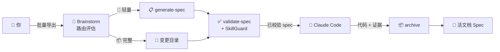
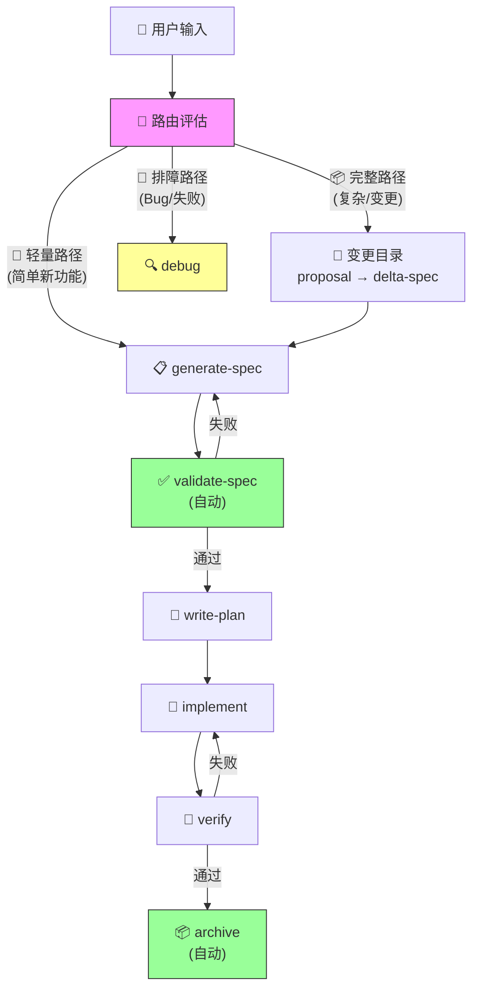

<div align="center">

# superSpec

**专为 Claude Code 设计的 AI 原生规格说明书管理工具。**

把自然语言变成可执行的规格说明书。在 AI 幻觉变成 bug 之前就抓住它。

[](LICENSE)
[]()
[]()

[English](./README.md) | 中文

</div>

---

## 你是否遇到过这种情况？

你告诉 Claude Code：*"给系统加个批量导出功能。"*

它写了 500 行代码。测试通过了。你合并了。

三天后你发现：
- PDF 导出从没提过，但 Claude 自己"脑补"了
- 错误处理只覆盖了 7 种失败模式中的 2 种
- "边界条件"测试其实是换了数据的正常流程测试

**需求在你脑子里，Claude 看不见。**

## superSpec 怎么解决

superSpec 卡在你的意图和 Claude 的代码之间。它强制要求在写代码*之前*先有一份结构化的规格说明书，然后校验代码是否真的匹配。



## 快速开始

```bash
# 1. 克隆并构建 superspec
git clone https://github.com/ChenJazzyBoss/superSpec.git
cd superSpec
npm install
npm run build
npm run bundle-validate

# 2. 进入你的项目，执行初始化
cd /path/to/your-project
node /path/to/superSpec/bin/superspec.js init
```

这会在你的项目中创建 `.superspec/` 和 `.claude/`。然后在 Claude Code 中：

```
/generate-spec
```

Claude 会问你问题，生成结构化的 spec，然后校验——在写任何代码之前。

## 它能做什么

📋 **结构化 spec** — 需求用 SHALL/MUST，场景用 Given/When/Then。没有歧义。

✅ **自动校验** — 9 条内置规则，抓缺失场景、模糊词汇、不完整覆盖。

🔍 **深度分析** — `--deep` 模式检测场景间逻辑矛盾和覆盖度缺口。

📊 **自动图表** — 添加 `<!-- DIAGRAM:flowchart -->`，Mermaid 图表自动生成并嵌入。

🔗 **源码追踪** — 添加 `<!-- source: src/foo.ts -->`，代码变更时提醒 spec 是否过时。

🏷️ **场景分类** — 场景自动标记为正常/异常/边界，缺少异常场景时警告。

🔄 **Delta 变更** — 只描述改了什么，不用重写整个文件。合并冲突不可能发生。

🛡️ **反幻觉设计** — 红线表和检查清单，防止 Claude 跳步或伪造完成。

🔍 **SkillGuard** — 程序化检测 AI 跳步模式。运行 `superspec guard` 验证技能配置。

📋 **Init Template** — 4 种项目类型模板（通用/Web API/CLI 工具/库），在生成 spec 前收集人类上下文。

📦 **多产物校验** — 使用 `superspec validate-modules` 校验模块清单。含循环依赖检测。

🤖 **子代理编排** — 每个任务双重 review：实现 → spec 审查 → 代码审查。

## CLI 命令

### `superspec init`

初始化项目。

```bash
superspec init                  # 默认配置
superspec init --interactive    # 交互式配置
superspec init --ci             # 包含 GitHub Actions workflow
superspec init --template web-api   # 使用 Web API 模板
superspec init --list-templates     # 列出所有可用模板
```

创建 `.superspec/` 目录结构，注入 `CLAUDE.md`，复制模板和脚本。

### `superspec validate <spec>`

校验 spec 文件。

```bash
superspec validate batch-export              # 按 spec 名称
superspec validate .superspec/specs/batch-export/spec.md  # 按文件路径
superspec validate batch-export --strict     # WARNING 也视为失败
superspec validate batch-export --deep       # 逻辑一致性分析
```

输出（JSON）：
```json
{
  "valid": true,
  "issues": [],
  "summary": { "errors": 0, "warnings": 0, "info": 0 },
  "scenarioTypes": {
    "requirements[0]": ["normal", "error", "boundary"]
  }
}
```

### `superspec ci`

批量校验所有 spec。

```bash
superspec ci              # 校验所有 spec
superspec ci --strict     # 严格模式
superspec ci --json       # JSON 输出
```

### `superspec generate <name>`

从 spec 生成测试代码骨架。

```bash
superspec generate batch-export                          # TypeScript（默认）
superspec generate batch-export -l python                # Python
superspec generate batch-export -o test/batch.test.ts    # 写入文件
```

### `superspec update <name>`

通过 Delta JSON 增量更新 spec。

```bash
cat delta.json | superspec update batch-export
superspec update batch-export -f delta.json
```

### `superspec diff <name>`

对比 spec 的当前版本与历史版本。

```bash
superspec diff batch-export                    # 与最新快照对比
superspec diff batch-export --from 2026-06-01  # 与指定版本对比
```

### `superspec history <name>`

列出 spec 的所有历史快照。

```bash
superspec history batch-export
```

### `superspec archive <name>`

归档已完成的变更。

```bash
superspec archive add-pdf-export
```

### `superspec changes`

列出进行中的变更。

```bash
superspec changes
```

### `superspec guard`

检查技能文件的反幻觉配置。

```bash
superspec guard src/skills/generate-spec/SKILL.md    # 检查技能配置
superspec guard src/skills/validate-spec/SKILL.md --json  # JSON 输出
```

验证技能文件是否配置了正确的红线表和 HARD-GATE 标签。

### `superspec validate-modules`

校验模块清单文件。

```bash
superspec validate-modules modules.md                    # 校验模块清单
superspec validate-modules modules.md -p my-project      # 指定项目名
superspec validate-modules modules.md --json             # JSON 输出
```

检查模块结构，检测循环依赖，验证命名规范。

### `superspec pipeline show`

显示默认工作流定义。

```bash
superspec pipeline show
```

输出：
```
📋 superSpec 默认工作流

  阶段              类型     依赖
  ──────────────── ──────── ──────────────────
  brainstorm        可选     —
  generate-spec     必需     brainstorm
  validate-spec     必需     generate-spec
  write-plan        必需     validate-spec
  implement         必需     write-plan
  verify            必需     implement
  archive           必需     verify
```

### `superspec pipeline next <stage>`

查询指定阶段的推荐下一步。

```bash
superspec pipeline next brainstorm        # → generate-spec
superspec pipeline next validate-spec     # → write-plan
superspec pipeline next archive           # → "已到达工作流末尾"
```

### `superspec pipeline run <name>`

运行管道——自动执行可程序化阶段（validate-spec、archive），AI 阶段输出操作指引。

```bash
superspec pipeline run batch-export                     # 从 validate-spec 开始
superspec pipeline run batch-export --from write-plan   # 从指定阶段恢复
```

执行记录持久化到 `.superspec/pipeline/<exec-id>.json`。

### `superspec pipeline status [name]`

查看管道执行状态。

```bash
superspec pipeline status               # 最新执行
superspec pipeline status batch-export  # 该 spec 的最新执行
superspec pipeline status --exec <id>   # 按执行 id 查询
```

### `superspec pipeline list`

列出所有管道执行记录。

```bash
superspec pipeline list
```

### `superspec pipeline resume <exec-id>`

恢复中断的管道执行。

```bash
superspec pipeline resume batch-export-20260611100000
```

### `superspec change`

变更生命周期管理（新功能和需求变更的统一模型）。

```bash
superspec change create <name>             # 创建变更目录和 proposal
superspec change create <name> --why "..." # 附带描述
superspec change list                      # 列出所有变更
superspec change status <name>             # 查看变更阶段和 capabilities
superspec change apply <name>              # 合并 delta spec 到主 spec
superspec change apply <name> --dry-run    # 仅校验不写入
```

### `superspec route`

评估用户意图并推荐路径。

```bash
superspec route "新增导出按钮"          # → 🚀 轻量路径
superspec route "实现完整认证系统" -c 3  # → 📦 完整路径
superspec route "修改导出格式为PDF"      # → 📦 完整路径（需求变更）
superspec route "导出功能报错了"          # → 🔧 排障路径
```

### `superspec uninstall`

移除 superSpec 生成的所有文件。

```bash
superspec uninstall        # 需要确认
superspec uninstall -y     # 跳过确认
```

## Spec 格式

spec 文件使用结构化 Markdown：

```markdown
# 功能名称

## Purpose

功能描述，说明做什么、为什么需要。
至少 50 个字符。

<!-- DIAGRAM:flowchart -->

## Requirements

### Requirement: 需求名称
系统 SHALL 做某件具体的事。

#### Scenario: 正常流程
Given 某个前置条件
When 某个动作
Then 预期结果

#### Scenario: 异常处理
Given 某个前置条件
When 发生错误
Then 错误被正确处理

#### Scenario: 边界条件
Given 边界数据
When 处理
Then 系统正确处理
```

### Spec 标注

| 标注 | 用途 | 示例 |
|------|------|------|
| `<!-- DIAGRAM:flowchart -->` | 自动生成流程图 | 校验后自动嵌入 |
| `<!-- DIAGRAM:state -->` | 自动生成状态图 | 校验后自动嵌入 |
| `<!-- source: path -->` | 关联源码文件 | `<!-- source: src/core/foo.ts -->` |

## 工作原理

### 1. 生成 spec

```
/generate-spec
```

Claude 问你需求，然后输出：

```markdown
# 批量导出

## Purpose
系统需要支持将数据批量导出为 CSV、XLSX、PDF 格式，
满足不同业务场景下的数据流转需求。

## Requirements

### Requirement: 格式支持
系统 SHALL 支持 CSV、XLSX 和 PDF 三种导出格式。

#### Scenario: 正常流程-CSV 导出
Given 用户在数据列表页面
When 选择 CSV 格式并点击导出
Then 系统生成 CSV 文件并下载

#### Scenario: 异常场景-导出失败
Given 用户在数据列表页面
When 导出过程中发生错误
Then 系统显示错误提示并记录日志
```

### 2. 校验

```bash
# 基础校验（格式 + 规则 + 场景分类）
node .superspec/scripts/validate.js .superspec/specs/batch-export/spec.md

# 深度校验（+ 逻辑一致性分析）
node .superspec/scripts/validate.js .superspec/specs/batch-export/spec.md --deep
```

```
✅ valid: true
   errors: 0, warnings: 0, info: 0

   scenarioTypes:
     requirements[0]: [normal, error, boundary]
```

### 3. 实现

```
/write-plan
/subagent-dev
```

Claude 创建详细计划，然后每个任务双重 review 实现。

### 4. 运行管道

```bash
superspec pipeline run batch-export
```

自动执行可程序化阶段（validate-spec、archive），AI 阶段输出操作指引。执行状态持久化——随时可以恢复。

### 5. 归档

```
/archive
```

变更被记录。Spec 持续增长。历史被保留。

## 功能列表

| 功能 | 说明 |
|------|------|
| 📋 **Spec 生成** | 自然语言 → 结构化 spec + 校验 |
| ✅ **9 条校验规则** | 抓缺失 SHALL、模糊词、不完整场景 |
| 🔍 **深度分析** | `--deep` 模式：逻辑矛盾检测、覆盖度缺口分析 |
| 📊 **自动图表** | `<!-- DIAGRAM:flowchart/state -->` → Mermaid 图表自动嵌入 |
| 🔗 **源码追踪** | `<!-- source: path -->` → 代码变更时提醒 spec 过时 |
| 🏷️ **场景分类** | 自动标记正常/异常/边界场景，缺异常时警告 |
| 🔄 **Delta 合并** | 增量 spec 变更，不用全量重写 |
| 🛡️ **反幻觉设计** | 红线表、检查清单、证据验证 |
| 🔍 **SkillGuard** | 程序化检测 AI 跳步模式 |
| 📋 **Init Template** | 4 种项目类型模板，在生成 spec 前收集人类上下文 |
| 📦 **多产物校验** | 模块清单校验，含循环依赖检测 |
| 🤖 **子代理管道** | 每任务：实现 → spec 审查 → 代码审查 |
| 🔀 **技能管道** | 7 阶段 DAG 工作流，前置/后置条件、上下文传递、重试策略 |
| 🚀 **管道执行** | `pipeline run/status/list/resume` — 自动执行可程序化阶段，持久化执行记录，支持恢复 |
| 📂 **统一变更模型** | 变更目录：proposal → delta spec → apply 生命周期（借鉴 OpenSpec） |
| 🧭 **中央路由器** | Brainstorm 技能路由新功能到统一管道，Bug 走排障路径 |
| 🔄 **Specs 合并引擎** | 合并 delta spec（ADDED/MODIFIED/REMOVED/RENAMED）到主 spec，支持 dry-run |
| 🛡️ **PipelineGuardRunner** | SkillGuard 钩子集成到管道执行：beforeExecute、onOutput、onCompletion |
| 🧭 **技能路由** | 每个技能有"下一步"部分，可通过 `pipeline next` 查询 |
| ⚙️ **配置分层** | 全局 → 项目 → 变更，优先级合并 |
| 📦 **归档系统** | 完整生命周期：草稿 → 进行中 → 审查 → 完成 |
| 🧪 **测试生成** | TypeScript (vitest) 和 Python (pytest) 骨架 |
| 🔌 **CI 集成** | GitHub Actions PR 校验工作流 |

## 为什么选 superSpec？

| | 传统 spec 工具 | superSpec |
|---|---|---|
| **什么时候写** | 代码写完后补 | 代码写之前 |
| **格式** | Word 文档、Confluence | 结构化 Markdown + 校验 |
| **执行方式** | 靠自觉 | 程序化规则，零容忍 |
| **AI 感知** | 无 | 专为 Claude Code 设计 |
| **变更追踪** | 全量重写文件 | Delta 合并 + 冲突检测 |
| **验证** | "看起来没问题" | 证据驱动，必须跑命令 |

## 完整工作流



基于复杂度评估的 3 条自适应路径。可程序化阶段（validate-spec、archive）通过 `pipeline run` 自动执行。AI 阶段输出操作指引，等待完成后恢复。

### PipelineGuardRunner

管道在运行时集成 SkillGuard。每个阶段执行都经过反幻觉检查：

```
阶段开始 → SkillGuard.beforeExecute() → 检查红线表 & HARD-GATE
阶段执行 → handler(context)
阶段输出 → SkillGuard.onOutput()      → 检测跳步模式 & 红线
阶段结束 → SkillGuard.onCompletion()  → 验证证据
```

如果技能文件缺少红线表，阶段被**阻断**——不是警告，是阻断。

## 反幻觉设计

每个高风险技能都包含：

**红线表** — 常见借口和为什么是错的：
| 借口 | 现实 |
|------|------|
| "应该没问题了" | 跑验证命令 |
| "子代理说完成了" | 子代理会幻觉完成 |
| "之前测试通过了" | 之前 ≠ 现在 |

**完成检查清单** — 每项都打勾才能宣布完成：
- [ ] 验证命令真的跑了
- [ ] 完整输出已读，退出码已检查
- [ ] 失败数量为 0

**XML 标签约束** — 技能定义中的行为守卫：
```xml
<HARD-GATE>
没有新鲜证据 = 不允许声明完成。没有例外。
</HARD-GATE>
```

## 项目结构

```
superSpec/
├── bin/superspec.js          # CLI 入口
├── CLAUDE.md                 # 项目 AI 行为指南
├── src/
│   ├── cli/index.ts          # CLI 命令
│   ├── core/
│   │   ├── validator.ts      # 校验引擎
│   │   ├── spec-parser.ts    # Markdown 解析器
│   │   ├── spec-schema.ts    # Zod Schema
│   │   ├── module-schema.ts  # 模块清单 Schema
│   │   ├── module-parser.ts  # 模块清单解析器
│   │   ├── module-validator.ts # 模块清单校验器
│   │   ├── deep-analysis.ts  # 逻辑一致性检查
│   │   ├── diagram-generator.ts  # 自动 Mermaid 图表
│   │   ├── source-tracker.ts # 源码关联追踪
│   │   ├── delta-merge.ts    # 增量 spec 更新
│   │   ├── change-lifecycle.ts   # 变更目录管理
│   │   ├── delta-spec-parser.ts  # Markdown delta spec 解析器
│   │   ├── specs-apply.ts    # Delta → 主 spec 合并引擎
│   │   ├── route-evaluator.ts    # 意图识别 & 路径路由
│   │   ├── anti-rationalization/ # SkillGuard 系统
│   │   ├── pipeline/         # 技能编排管道
│   │   │   ├── executor.ts   # 管道执行引擎
│   │   │   ├── runner.ts     # CLI 运行时（run/status/list/resume）
│   │   │   ├── guard-runner.ts   # SkillGuard 集成
│   │   │   ├── context.ts    # 阶段间上下文传递
│   │   │   ├── conditions.ts # 前置/后置条件检查
│   │   │   ├── retry.ts      # 失败分类 & 重试
│   │   │   └── workflow.ts   # 默认 7 阶段 DAG 定义
│   │   ├── rules/            # 校验规则
│   │   ├── diagrams/         # 图表生成器
│   │   └── config/           # 配置系统
│   ├── adapters/             # 测试代码生成器
│   └── ci/                   # CI 运行器
├── templates/                # 项目模板
│   ├── spec-template.md      # Spec 模板
│   ├── init-spec-template.md # Init Template（收集上下文）
│   ├── change/               # 变更生命周期模板
│   └── init-templates/       # 项目类型模板
│       ├── general.md        # 通用项目
│       ├── web-api.md        # Web API 项目
│       ├── cli.md            # CLI 工具项目
│       └── library.md        # 库/SDK 项目
├── test/                     # 测试套件（563 个测试）
└── dist/                     # 构建产物
```

## 致谢

superSpec 站在两个优秀项目的肩膀上：

**[OpenSpec](https://github.com/openspec-dev/openspec)** — specs/changes/archive 目录模型和行为契约 spec 格式，直接借鉴了 OpenSpec 的结构化规格管理方法。他们"spec 是活文档，不是一次性产物"的理念，塑造了 superSpec 的核心架构。delta spec 合并引擎和跨 section 冲突检测也借鉴了 OpenSpec 的设计。

**[superpowers-zh](https://github.com/superpowers-dev/superpowers-zh)** — 运行时行为约束（XML 标签、反幻觉模式、子代理编排）受到了 superpowers-zh 的 AI 编码会话控制方法论的启发。

感谢两个项目的开源精神。🙏

## 参与贡献

发现 bug？[提个 issue](../../issues)。

想贡献代码？Fork、建分支、提 PR。欢迎所有贡献。

有想法？开个 [discussion](../../discussions)。

## License

MIT
