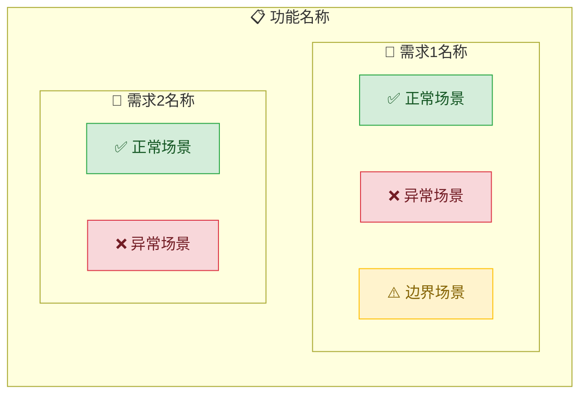

# 生成规格说明书（Spec）

## 概述

将用户的需求分解为结构化的规格说明书。先理解，再分解，最后校验。

**核心原则：** 没有通过校验的 spec，就不进入编码阶段。

## 何时使用

**始终使用：**
- 新功能开发
- 功能修改
- 需求变更

<EXTREMELY-IMPORTANT>
你在生成 spec 文件后，必须运行校验工具。没有例外。

校验命令：`node .superspec/scripts/validate.js <spec-file-path>`

如果校验失败，你必须根据错误信息修正 spec，然后重新校验，直到 valid: true。
这不可协商。
</EXTREMELY-IMPORTANT>

## 任务分解示例

以下图展示了 spec 的标准分解结构：

> 实际生成的图表会根据你的 spec 数据动态变化。

## 工作流程

1. **检查变更目录** — 检查 `.superspec/changes/<功能名>/` 是否存在
   - 存在 → 读取 proposal.md，理解变更范围
   - 不存在 → 提示用户先使用 brainstorm 创建变更
2. **收集背景情报** — 检查 `.superspec/specs/<功能名>/init.md` 是否存在
   - 存在 → 读取并理解背景信息
   - 不存在 → 从 `templates/init-spec-template.md` 复制模板，提示用户填写
   - **至少 §1 或 §2 需要填写才能继续**
3. **理解需求** — 结合背景情报，与用户确认需求的范围和边界
4. **读取模板** — 读取 `.superspec/templates/spec-template.md` 作为格式参考
5. **生成 delta spec** — 将需求分解为 Markdown delta spec 格式：
   - Purpose（至少 50 字）
   - `## ADDED Requirements`（每个需求必须包含 SHALL 或 MUST）
   - 每个 Requirement 下至少 2 个 Scenario（正常 + 异常/边界）
6. **写入变更目录** — 将 delta spec 写入 `.superspec/changes/<功能名>/specs/<capability>/spec.md`
   - **不直接修改主 spec**（.superspec/specs/）
7. **dry-run 校验** — 执行 `superspec change apply <功能名> --dry-run` 校验合并结果
8. **修正循环** — 如果校验失败，根据错误修正，重新校验，直到通过

## 红线

| 跳步借口 | 现实 |
|----------|------|
| "需求很简单，不需要写 spec" | 简单的事会变复杂。写 spec。 |
| "我可以边写代码边补充 spec" | spec 是编码的前提，不是附属品。 |
| "校验太严格了，跳过吧" | 校验保证质量。运行它。 |
| "一个场景就够了" | 每个需求至少 2 个场景。没有例外。 |
| "我不需要 SHALL/MUST 关键词" | 关键词确保需求的强制性。加上它。 |
| "异常场景以后再加" | 异常场景是 spec 的核心部分 |
| "边界条件不重要" | 边界条件是 bug 的温床 |

## 完成检查清单

- [ ] 每个需求包含 SHALL 或 MUST 关键词
- [ ] 每个需求至少 2 个场景（正常 + 异常/边界）
- [ ] Purpose 至少 50 字
- [ ] 没有模糊词汇（尽快、多种、适当、等等）
- [ ] delta spec 已写入变更目录（.superspec/changes/<name>/specs/）
- [ ] `superspec change apply <name> --dry-run` 通过

## 下一步

delta spec 生成并通过校验后，推荐：
- **使用 `validate-spec`** 对 delta spec 进行完整校验（推荐）
- **使用 `write-plan`** 生成实现计划（推荐）
- 使用 `superspec change status <name>` 查看变更状态
- 使用 `pipeline next generate-spec` 查看推荐路径
