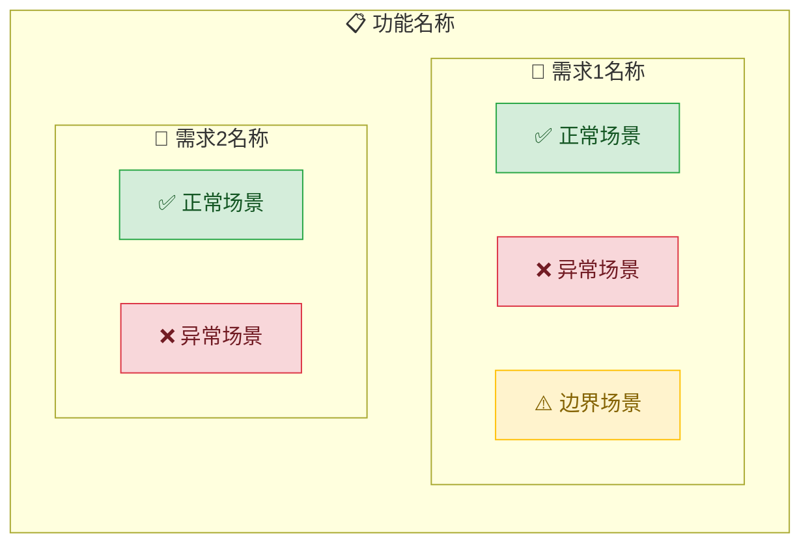

# 生成规格说明书（Spec）

## 概述

将用户的需求分解为结构化的规格说明书。先收集上下文，再理解，再分解，最后校验。

**核心原则：** 没有通过校验的 spec，就不进入编码阶段。

**Skill 标识**: `generate-spec`

## 何时使用

**始终使用：**
- 新功能开发
- 功能修改
- 需求变更

**不要用于：**
- 纯配置变更（改环境变量、改构建参数）
- 文档更新（改 README、改注释）
- 依赖升级（不涉及功能变化）

---

## 扩展点

| 配置字段 | 用途 | 默认值 |
|---------|------|--------|
| `spec.min_purpose_length` | Purpose 最少字符数 | 50 |
| `spec.min_scenario_count` | 每条需求最少场景数 | 2 |
| `spec.recommended_scenario_count` | 推荐场景数 | 3 |

---

<EXTREMELY-IMPORTANT>
你在生成 spec 文件后，必须运行校验工具。没有例外。

校验命令：`node .superspec/scripts/validate.js <spec-file-path>`

如果校验失败，你必须根据错误信息修正 spec，然后重新校验，直到 valid: true。
这不可协商。
</EXTREMELY-IMPORTANT>

---

## 强制检查清单

<EXTREMELY-IMPORTANT>
在开始生成 spec 之前，你必须完成以下检查清单。
按顺序执行，跳步被禁止。每完成一步，标记为 [x] 并附带证据。
</EXTREMELY-IMPORTANT>

- [ ] 声明使用本技能："我将使用 generate-spec 技能来生成规格说明书"
- [ ] 收集背景情报（Init Template）— 读取或创建 `.superspec/specs/<功能名>/init.md`
- [ ] 探索项目上下文 — 检查现有代码、文档、相关 spec
- [ ] 与用户确认需求范围和边界
- [ ] 读取模板 `.superspec/templates/spec-template.md`
- [ ] 生成 spec 内容
- [ ] 嵌入图表
- [ ] 写入文件
- [ ] 运行校验并通过

---

## Step 0: 收集背景情报（Init Template）

<HARD-GATE>
在开始分析需求之前，必须先收集人类独有的上下文信息。
AI 无法从代码库中获取业务动机、历史决策、架构约束——这些在人类脑子里。
</HARD-GATE>

### 0.1 检查 Init Template 是否存在

检查路径：`.superspec/specs/<功能名>/init.md`

- **存在** → 读取并进入 Step 0.2
- **不存在** → 创建模板并提示用户填写

### 0.2 Init Template 模板

如果文件不存在，创建以下内容：

```markdown
# 背景情报简报 — <功能名称>

> 在开始生成 spec 之前，AI 会读取此文件收集上下文。
> §1 和 §2 至少填一项即可继续。其他节为选填。

## §1 需求描述 ⭐强烈建议提供
<!-- 粘贴或描述本次要实现的核心功能/业务价值 -->
<!-- 支持任意格式：文字描述、文件路径、PRD 摘要、会议记录 -->

## §2 目标用户 ⭐建议提供
<!-- 这个功能面向哪些用户角色？ -->
<!-- 格式示例：管理员（需要管理所有用户）、普通用户（需要查看自己的数据） -->

## §3 关键业务场景（选填）
<!-- 核心使用场景，用自己的语言描述，不需要 Given/When/Then 格式 -->

## §4 领域术语约定（选填）
<!-- 表格格式：业务术语 | 标准名称 | 说明 -->
<!-- 避免 AI 用不同名称指代同一概念 -->

| 业务术语 | 标准名称 | 说明 |
|---------|---------|------|
| | | |

## §5 约束与不做的事（选填）
<!-- 本次迭代明确不包含什么？有什么技术约束？ -->
<!-- 明确排除项，防止范围蔓延 -->

## §6 参考资料（选填）
<!-- 竞品分析、历史设计文档、相关 spec 路径 -->
```

### 0.3 Init Template 完整性校验

<HARD-GATE>
必须评估 Init Template 的信息质量（不只是非空）。
</HARD-GATE>

校验规则：
- §1 需求描述 → 必须清楚陈述"要做什么、为什么做"
- §2 目标用户 → 必须有具体角色描述
- §5 约束 → 如果有，检查是否与需求矛盾

输出格式：
```
✅ §1 需求描述：[一句话概括]
✅ §2 目标用户：识别到 N 个角色
⚠️ §4 领域术语：未填写（非阻塞）
🚫 §1 需求描述：信息过于简单 → 必须补充
```

**阻断条件**：§1 和 §2 都为空或信息过于简单 → 停止，要求用户补充

---

## Step 1: 探索项目上下文

在生成 spec 之前，探索项目的现有上下文：

1. **检查现有代码**
   - 相关模块的代码结构
   - 已有的 API 接口
   - 数据模型定义

2. **检查现有文档**
   - README.md
   - 已有的 spec 文件（`.superspec/specs/`）
   - 设计文档（如有）

3. **检查相关 spec**
   - 是否有依赖的 spec
   - 是否有冲突的 spec

---

## Step 2: 与用户确认需求

通过结构化问答确认需求：

1. **一次问一个问题** — 不要一次问多个
2. **优先选择题** — 减少用户决策负担
3. **清楚即止** — 不要过度追问

确认内容：
- 功能范围（做什么、不做什么）
- 用户角色（谁在用）
- 核心场景（怎么用）
- 验收标准（怎么算完成）

---

## Step 3: 生成 Spec

### 3.1 读取模板

读取 `.superspec/templates/spec-template.md` 作为格式参考。

### 3.2 生成 Purpose

Purpose 要求：
- **最少 50 字**（硬性要求）
- 说明为什么需要这个功能
- 说明这个功能为谁解决什么问题
- 不要写实现细节

### 3.3 生成 Requirements

每条 Requirement 要求：
- **必须包含 SHALL 或 MUST 关键词**
- 使用 RFC 2119 语义（SHALL = 必须，MUST = 必须）
- 不要包含实现决策（如"使用 Redis"）
- 使用业务语言，不使用技术术语

### 3.4 生成 Scenarios

每条 Requirement 至少 2 个场景，推荐 3 个。

**5 种场景类型**（借鉴 cospowers system-requirement-analysis）：

| 类型 | 要求 | 示例 |
|------|------|------|
| ✅ 正常流程 | 必填，1-2 个 | Given 有效输入 → 预期成功 |
| ❌ 异常流程 | 必填，1-2 个 | Given 无效输入 → 预期错误提示 |
| 🔒 安全性 | 建议，1 个 | Given 无权限用户 → 预期 403 |
| ⚠️ 边界条件 | 建议，1 个 | Given 超大数据量 → 预期正常处理 |
| 🧪 可测试性 | 建议，1 个 | 如何构造测试数据并验证 |

**场景类型检查**：
- 如果所有场景都是正常流程 → WARNING: "场景类型单一，建议补充异常或边界场景"
- 每条 Requirement 至少覆盖 2 种类型

### 3.5 Given-When-Then 格式

```markdown
#### Scenario: <场景名称>
Given <前置条件（业务语言）>
When <用户操作（避免技术细节）>
Then <用户可见的预期结果>
```

要求：
- Given 必须描述具体的前置条件
- When 必须描述具体的触发动作
- Then 必须描述可验证的预期结果
- 不要使用"系统应该..."这种模糊表述

---

## Step 4: 嵌入图表

使用图表集成器在 spec 中嵌入任务分解图。

将 `<!-- DIAGRAM:flowchart -->` 占位符替换为 Mermaid 图表代码。

图表会自动根据 spec 数据生成：
- 需求 → 子图
- 场景 → 节点，按类型着色（✅绿色/❌红色/⚠️黄色）

---

## Step 5: 写入文件

将 spec 写入 `.superspec/specs/<功能名>/spec.md`

目录结构：
```
.superspec/specs/
  <功能名>/
    spec.md          ← 当前版本
    init.md          ← 背景情报简报
    history/         ← 快照目录（校验通过时自动保存）
```

---

## Step 6: 运行校验

执行校验命令：
```bash
node .superspec/scripts/validate.js .superspec/specs/<功能名>/spec.md
```

校验结果解读：
- `valid: true` → 通过，进入 Step 7
- `valid: false` → 有错误，必须修正
- `warnings` → 建议修正，不阻断

---

## Step 7: 修正循环

<HARD-GATE>
校验失败必须修正并重新校验，直到 valid: true。
这不可协商。没有例外。
</HARD-GATE>

修正流程：
1. 读取校验报告中的错误列表
2. 逐个修正错误
3. 重新运行校验
4. 重复直到 `valid: true`

常见错误及修正方法：

| 错误 | 原因 | 修正方法 |
|------|------|---------|
| 需求文本必须包含 SHALL 或 MUST | 缺少关键词 | 在需求描述中加入 SHALL 或 MUST |
| 需求仅有 N 个场景，至少需要 2 个 | 场景不足 | 添加异常或边界场景 |
| 概述仅 N 字符，建议扩展到 50 字以上 | Purpose 太短 | 扩展 Purpose 描述 |
| 需求名称重复 | 重名 | 修改需求名称使其唯一 |
| 场景名称重复 | 重名 | 修改场景名称使其唯一 |

---

## 增量对齐检查点

借鉴 cospowers 的增量对齐模式，分段确认避免大返工：

**检查点 1: Init Template 确认**
- 背景情报是否充分？
- 是否有遗漏的关键信息？

**检查点 2: Requirements 确认**
- 需求清单是否完整？
- 每条需求的 SHALL/MUST 是否准确？

**检查点 3: Scenarios 确认**
- 场景类型是否覆盖足够？
- Given/When/Then 是否清晰？

**检查点 4: 最终确认**
- 图表是否正确？
- 校验是否通过？

每个检查点都应向用户展示当前状态并获取确认，避免最后才发现问题。

---

## 红线

| 想法 | 现实 |
|------|------|
| "需求很简单，不需要写 spec" | 简单的事会变复杂。写 spec。 |
| "我可以边写代码边补充 spec" | spec 是编码的前提，不是附属品。 |
| "校验太严格了，跳过吧" | 校验保证质量。运行它。 |
| "一个场景就够了" | 每个需求至少 2 个场景。没有例外。 |
| "我不需要 SHALL/MUST 关键词" | 关键词确保需求的强制性。加上它。 |
| "异常场景以后再加" | 异常场景是 spec 的核心部分，不能延后。 |
| "边界条件不重要" | 边界条件是 bug 的温床。 |
| "这个功能太简单了，不需要 Init Template" | 简单的功能也有隐含假设，收集上下文。 |
| "之前校验通过了，这次变动不大" | 每次修改后必须重新校验，之前通过≠现在通过。 |
| "我可以跳过探索项目上下文" | 不了解现有代码就写 spec = 制造冲突。 |
| "用户说的很清楚了，不需要确认" | 你的理解 ≠ 用户的意图。确认。 |
| "Purpose 写够 50 字就行" | Purpose 要让读者理解为什么需要这个功能，不是凑字数。 |

---

## 证据驱动完成声明

<EXTREMELY-IMPORTANT>
完成检查清单的每一项都必须附带证据。
没有证据的完成声明 = 说谎。
</EXTREMELY-IMPORTANT>

## 完成检查清单

- [ ] Init Template 已创建并填写
      证据：init.md 文件存在，§1 和 §2 已填写内容为：______

- [ ] 项目上下文已探索
      证据：检查了以下文件/目录：______

- [ ] 需求范围已与用户确认
      证据：用户确认了以下范围：______

- [ ] 每个需求包含 SHALL 或 MUST 关键词
      证据：spec 中共有 N 条需求，每条都包含 SHALL/MUST

- [ ] 每个需求至少 2 个场景（正常 + 异常/边界）
      证据：最少场景数的需求是"XXX"，有 N 个场景

- [ ] 场景类型覆盖至少 2 种
      证据：覆盖了以下类型：正常(X个)、异常(X个)、边界(X个)

- [ ] Purpose 至少 50 字
      证据：Purpose 共 N 字

- [ ] 没有模糊词汇（尽快、多种、适当、等等）
      证据：搜索模糊词结果为 0

- [ ] 图表已嵌入 spec
      证据：spec 中包含 mermaid 代码块

- [ ] `superspec validate` 通过（valid: true, 0 errors）
      证据：校验输出为 `{"valid":true,"issues":[],"summary":{"errors":0,"warnings":0,"info":0}}`

---

## 任务分解示例

以下图展示了 spec 的标准分解结构：



> 实际生成的图表会根据你的 spec 数据动态变化。

---

## 下一步

spec 校验通过后，可以：
- 使用 `write-plan` 生成实现计划
- 使用 `generate-test` 生成测试代码骨架
- 使用 `subagent-dev` 开始子 Agent 驱动开发
