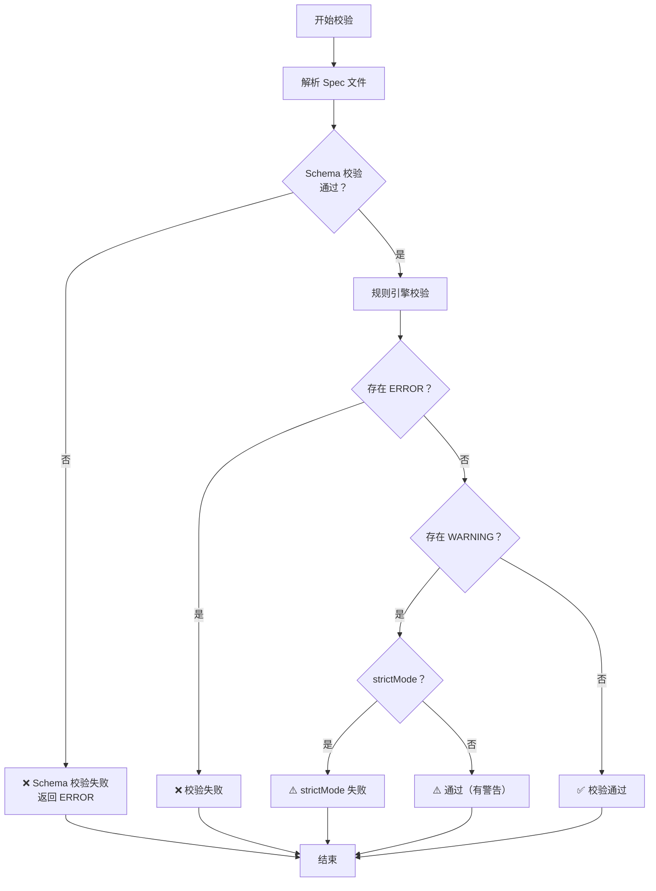

# 校验规格说明书（Validate Spec）

## 概述

对 spec 文件运行程序化校验，确保结构完整、内容合规。

**核心原则：** 校验不是可选的，是每次修改 spec 后的必经步骤。

**Skill 标识**: `validate-spec`

## 何时使用

**始终使用：**
- 修改 spec 文件后
- 生成新 spec 后
- 合并 spec 变更后
- 归档 spec 前

**不要用于：**
- 校验非 spec 文件（如代码、配置）
- 校验格式不符合 spec-template.md 的文件

<SUBAGENT-STOP>
如果你是作为子智能体被分派来执行特定任务的，跳过此技能。
</SUBAGENT-STOP>

---

<EXTREMELY-IMPORTANT>
校验失败时，你必须修正 spec 并重新校验。不要跳过校验，不要忽略错误。
这不可协商。
</EXTREMELY-IMPORTANT>

---

## 强制检查清单

<EXTREMELY-IMPORTANT>
在开始校验之前，你必须完成以下检查清单。
按顺序执行，跳步被禁止。
</EXTREMELY-IMPORTANT>

- [ ] 声明使用本技能："我将使用 validate-spec 技能来校验规格说明书"
- [ ] 确认校验目标文件路径正确
- [ ] 运行校验命令
- [ ] 读取完整校验输出
- [ ] 根据分级处理逻辑处理结果
- [ ] 如果有 ERROR，修正并重新校验

---

## 校验命令

```bash
node .superspec/scripts/validate.js <spec-file-path>
```

例如：
```bash
node .superspec/scripts/validate.js .superspec/specs/batch-export/spec.md
```

**严格模式**（warnings 也视为失败）：
```bash
node .superspec/scripts/validate.js --strict <spec-file-path>
```

---

## 校验决策流程



---

## 输出格式

校验工具输出 JSON 格式：

```json
{
  "valid": true,
  "issues": [],
  "summary": { "errors": 0, "warnings": 0, "info": 0 }
}
```

---

## 分级处理逻辑

借鉴 cospowers 的分级处理模式，校验结果按严重程度分三级处理：

### 🔴 阻断级（ERROR）

**含义**：结构性问题，必须修正

**处理方式**：
1. 立即停止后续流程
2. 根据错误信息修正 spec
3. 重新运行校验
4. 重复直到 ERROR 数量为 0

**示例**：
- 需求文本缺少 SHALL/MUST 关键词
- 场景数不足 2 个
- Purpose 不足 50 字
- 需求名称重复

### 🟡 建议级（WARNING）

**含义**：质量问题，建议修正

**处理方式**：
1. 评估每个 WARNING 是否需要修正
2. 如果需要修正，修正后重新校验
3. 如果确认不需要修正，记录原因

**示例**：
- 场景类型单一（只有正常流程）
- 包含模糊词汇
- 图表未嵌入

### 🔵 提示级（INFO）

**含义**：改进建议，仅供参考

**处理方式**：
1. 了解即可，不阻断流程
2. 如果有时间，可以改进

**示例**：
- 概述长度建议扩展到 100 字
- 需求包含主观性表述

---

## 如何处理校验结果

### valid: true
校验通过。spec 质量合格。

**下一步**：
- 如果有 WARNING，评估是否需要修正
- 如果有 INFO，了解改进建议
- 进入下一个流程步骤

### valid: false
校验失败。查看 issues 数组中的错误：

| level | 含义 | 处理方式 |
|-------|------|---------|
| ERROR | 🔴 阻断级 | 必须修正，重新校验 |
| WARNING | 🟡 建议级 | 评估后决定是否修正 |
| INFO | 🔵 提示级 | 仅供参考 |

---

## 常见错误及修正方法

### 🔴 阻断级错误

| 错误信息 | 原因 | 修正方法 |
|---------|------|---------|
| "概述内容至少需要 50 个字符" | Purpose 太短 | 补充功能的目的和价值描述 |
| "需求文本必须包含 SHALL 或 MUST" | 缺少强制性关键词 | 在需求描述中加入 SHALL 或 MUST |
| "每条需求至少需要关联 2 个场景" | 场景数不足 | 补充异常/边界场景 |
| "场景原始文本至少需要 10 个字符" | 场景描述太短 | 补充 Given/When/Then 的具体内容 |
| "规格中至少需要包含 1 条需求" | 没有需求 | 添加至少一条 Requirement |
| "需求名称重复" | 重名 | 修改需求名称使其唯一 |
| "场景名称重复" | 重名 | 修改场景名称使其唯一 |

### 🟡 建议级警告

| 警告信息 | 原因 | 修正方法 |
|---------|------|---------|
| "场景类型单一" | 只有正常流程 | 添加异常或边界场景 |
| "包含模糊词汇" | 使用了尽快/适当/良好等词 | 使用可量化的表述 |
| "建议嵌入图表" | 缺少 Mermaid 图表 | 添加 `<!-- DIAGRAM:flowchart -->` 占位符 |

---

## 修正循环

<HARD-GATE>
校验失败必须修正并重新校验，直到 valid: true。
这不可协商。没有例外。
</HARD-GATE>

修正流程：
1. 读取校验报告中的错误列表
2. 按分级处理逻辑分类（🔴/🟡/🔵）
3. 先处理 🔴 阻断级错误
4. 再评估 🟡 建议级警告
5. 重新运行校验
6. 重复直到 `valid: true`

**修正原则**：
- 一次修正一个问题，不要批量修改
- 修正后立即重新校验，不要等全部改完
- 如果不确定如何修正，先问用户

---

## 红线

| 想法 | 现实 |
|------|------|
| "校验太严格了，跳过吧" | 校验保证质量，不能跳。 |
| "错误是误报，忽略就行" | 先确认是否真误报，再决定。 |
| "WARNING 不重要" | WARNING 可能演变成 ERROR。 |
| "改完代码再校验" | spec 改了就立刻校验。 |
| "这个 spec 之前通过了" | 之前通过不代表改完还通过。 |
| "这个错误不影响功能" | 结构性问题迟早会引发 bug。 |
| "我可以手动修复，不需要重新校验" | 手动修复可能引入新问题，必须重新校验。 |
| "校验输出太长了，我看关键部分就行" | 必须读完整输出，不能只看摘要。 |
| "这次改动很小，不需要校验" | 小改动也可能破坏结构完整性。 |
| "用户在等结果，先跳过校验" | 质量不能因为时间压力而妥协。 |

---

## 证据驱动完成声明

<EXTREMELY-IMPORTANT>
完成检查清单的每一项都必须附带证据。
没有证据的完成声明 = 说谎。
</EXTREMELY-IMPORTANT>

## 完成检查清单

- [ ] 校验命令已实际运行
      证据：执行了命令 `______`，输出为 `______`

- [ ] 输出中 valid: true
      证据：校验输出 JSON 中 `"valid": true`

- [ ] errors 数量为 0
      证据：`"summary": {"errors": 0, ...}`

- [ ] warnings 已评估是否需要修正
      证据：共有 N 个 warnings，已修正 X 个，确认不需要修正 Y 个，原因为：______

- [ ] 如果校验失败，已修正并重新校验
      证据：修正了以下问题：______，重新校验结果为 `valid: true`

- [ ] 校验输出已完整读取
      证据：读取了完整的 JSON 输出，包含 issues 数组和 summary

---

## 批量校验

如果需要校验多个 spec 文件，使用 CI 命令：

```bash
node .superspec/scripts/validate.js --ci
```

或使用 CLI：
```bash
npx superspec ci
```

**输出格式**：
```
superSpec CI 校验结果

总计: N 个 spec
通过: X
失败: Y

  ✅ PASS spec-name (0 error, 2 warning)
  ❌ FAIL spec-name (1 error, 0 warning)
    ❌ 需求文本必须包含 SHALL 或 MUST 关键词
```

---

## 下一步

校验通过后，推荐：
- **使用 `write-plan`** 生成实现计划（推荐）
- 使用 `generate-test` 生成测试代码骨架
- 使用 `subagent-dev` 开始子 Agent 驱动开发
- 使用 `archive` 归档完成的变更
- 使用 `pipeline next validate-spec` 查看推荐路径
